# **Spinner**
```Kotlin
//Este es el arreglo

val Nombres = *arrayOf*("Mario", "Carlos", "Perla", "Santiago", "Ramiro")


override fun onCreate(savedInstanceState: Bundle?) {
      super.onCreate(savedInstanceState)
      setContentView(R.layout.*activity_main*)

val lista = findViewById<Spinner>(R.id.*spLista*)
val mensaje = findViewById<TextView>(R.id.*textVista*)

//genera adaptadores, que son las visualizaciones para los elementos(Spinner o recycle view)
//que muestran el adaptador puede tener imagen, text view
val adapter = ArrayAdapter(this, android.R.*layout*.*simple_spinner_item*, Nombres)

//lista es el adaptador  del adaptador creado
lista.*adapter* = adapter

//onItemSelectedListener toma los valores del adaptador
lista.*onItemSelectedListener* = object :
AdapterView.OnItemSelectedListener {
      override fun onNothingSelected(parent: AdapterView<*>?) {
          *TODO*("not implemented") //To change body of created functions use File | Settings | File Templates.
      }

      override fun onItemSelected(
          parent: AdapterView<*>?,
          view: View?,
          position: Int,
          id: Long
      ) {

          Toast.makeText(
              this@MainActivity, "Seleccionado " + Nombres[position],
              Toast.LENGTH_LONG
          ).show()

          mensaje.text = Nombres[position]
      }
}

}
```


# **Girar la pantalla en Horizontal o vertical**
Agregas está línea de código en el archivo AndroidManifest.xml para poner la pantalla en vertical;

```Gradle
<activity android:name=".MainActivity"   android:screenOrientation="portrait">
```

Agregas está línea de código en el archivo AndroidManifest.xml para poner la pantalla en horizontal;

```Gradle
<activity android:name=".MainActivity" android:screenOrientation="landscape">
```

**Validar la orientación de la pantalla**

Con este código se puede validar si la pantalla está en orientación landscape o portrait.

```Kotlin
val configuration = LocalConfiguration.current 

val isLandscape = configuration.orientation == Configuration.ORIENTATION_LANDSCAPE
```

# **Palabras reservadas**
fun=función 

var=variable

val=  constante

Math = clase matemáticas, con las funciones mátemáticas

- .cos()= función para calcular el coseno

this. = hace referencia a una variable creada dentro de una clase, NO a una variable que recibe en los parámetros de la clase

constructor

# **Tipos de datos**
Double			64  bits

Float				32 bits

Long				64 bits

Int				32 bits

Short				16 bits

Byte				 8 bits

Characters 			un caracter

String, 				una cadena

Arrays,				Matriz

Booleans			lógico

# **Conversión de tipo de dato**

```Kotlin
//esto se hace en los tipos de dato char, ya que el número en char es 48 numeros superior a su igual en Decimal

*Tipo de Dato*:toInt() – 48 
```


# **Funciones String.**
## **Acceder a un elemento dentro de una cadena (String)**
```Kotlin
*variable*[*Posición*]
```
## **Saber el tamaño de una cadena**
```Kotlin
*variable*.length
```

## **Tipos de Strings**
Strings con secuencia de Escape: se pueden agregar secuencias de escape(n, u, etc)

Strings puros: son los strings que solamente imprimen lo que está en comillas(“,”””)
## **Imprimir una variable string sin usar +**
```Kotlin
println(“*Texto* $*Variable*”)
```
# **Arreglos**
```Kotlin
//un arreglo explícito

var *Nombre*: Array<*Tipo de dato*> = arrayOf(*contenido*,*contenido*,*contenido*)

//un arreglo implícito

var arreglo = int ArrayOf(1,2,3)

var *Nombre* = *Tipo de dato*ArrayOf(1,2,3)
```

## **Imprimir contenido de un arreglo**
```Kotlin
printl(*Nombre*[*posición*])
```
# **Variables que no sabes que tipo de dato serán**
```Kotlin
var *Nombre*:Any = *Valor*
```
# **Estructura de control**
```Kotlin
//forma corta del if else

If(*variable/valor* > *variable/valor*) *accion* else *acción*
```

# **When**
```Kotlin
//ejemplos de when

when (x) {

      1 -> print("x == 1")

      2 -> print("x == 2")

      else -> { // Note the block

          print("x is neither 1 nor 2")

      }

}

//evitamos estar marcando cada opción

When(*variable*){

1 -> *variable* = *accion*

2 -> *variable* = *accion*

3,4,5,6 -> *variable* = {*accion*

}

.

.

.

.

.

Else -> *variable* = *acción*

}

//ponemos un rango de opciones

When(*variable*){

in 1..5 -> *variable* = {*accion*}

.

.

.

.

.

Else -> *variable* = *acción*

}
```

# **Ciclo for**
```Kotlin
//forma corta

for (*variable*:*tipo de dato* in 1..5) *acción*

//forma larga

for (*variable*  in 1..5){

*acción*

}

//doble variable y matriz

fun main(args: Array<String>) {
var arregloInt = intArrayOf(4,5,6,7,8,9,10,11,12,13,14,15,16,17,18)
      for ((indice, valor)in arregloInt.withIndex()){
          println ("El indice $indice representa el valor $valor")
      }
}
```

# **Ciclo while**
```Kotlin
//la forma corta
while(x<=10){
  println(x)
  x=x+1
}

//do while
var y=1
do{
  print("Estoy dentro")
}
while(y!=1)
```

# **Funciones**
```Kotlin
//especificando el tipo de dato de la función

var *variable* = *función*(*valor*,*valor*)

println(resultado)

fun *función*(*variable*:*Tipo de dato*, *variable*:*Tipo de dato*):*Tipo de dato*{

}
```

# **Inicializar las variables**
```Kotlin
init{
this.*variable* = *variable*
.
.
.
.
}
```

# **Crear Objetos**
```Kotlin
var *nombre* = *clase*()
```

# **Acceder a una propiedad del objeto**
```Kotlin
*objeto*.*propiedad*
```

# **Crear funciones**
```Kotlin
//sin pasar parámetros
fun *nombre*() {
     *acción*
}
```

# **Método constructor(construye objetos)**
```Kotlin
constructor(*parametro*:*Tipo de dato*…):this(){

this.*variable* = *parametro*
.
.
.
}
```

# **Tipos de clases**
```Kotlin
//Clases tipo open: puedes hacer que otras clases, hereden atributos o métodos de la clase open.

open class *nombre de la clase*(){
.
.
.
.
}


//Clases tipo final: una vez escrito/compilado en el programa, ya no puedes heredar o modificar de ellas.

class *nombre de la clase*(){
.
.
.
.
}
```

# **Herencia entre clases**
```Kotlin
class *nombre de la clase*():*clase padre*(){
.
.
.
}
```

# **Como sacar un elemento de interfaz de un fragment**
```Kotlin
var lista:RecyclerView ?= null
lista = *activity*?.findViewById(R.id.*lista*)
```

# **Como sacar el contexto de un fragment**
```Kotlin
var contexto = requireContext().*applicationContext*
//otra forma de sacarlo
val appContext = context!!.applicationContext
```

# **Como pasar entre interfaces**
```Kotlin
val *nombre de la variable*: Intent = Intent(applicationContext, *Interfaz*::class.java)
startActivity(*variable*)
//otra forma de moverte
val *nombre de la variable* = Intent(this, *Clase a ingresar*::class.java)
startActivity(*variable*)
```

# **Como sacar información de elementos en una interfaz**
```Kotlin
//sacar información de un plainText
var *nombre de variable* = findViewById<EditText>(R.id.*Id del plaintext*)
//otra forma de sacar el texto del plain text
var *variable* = *identificador del plain text*.text.toString()
//otra forma de sacar información del plain text:
var nombre:EditText ?= null
nombre?.*text*.toString()
```

# **Como crear funciones a los botones**
```Kotlin
//que funcione al dar click
val *Nombre de variable* = findViewById<Button>(R.id.*Id del botón*)
*variable*.setOnClickListener(View.OnClickListener {
})
```

# **Como pasar valores entre activitys**
```Kotlin
//con esto lo mandas
val *nombre de la variable* : Intent = Intent(applicationContext, *Clase a ingresar*::class.java)
*variable*.putExtra("*identificador*",*valor a pasar*)
*variable*.putExtra("*identificador2*",*valor a pasar*)
*variable*.putExtra("*identificador3*",*valor a pasar*)
startActivity(*variable*)

//con esto lo recibes
val extras = intent.extras
val *Nombre de variable* = extras?.getString("identificador")?:*valor inicial*
val *Nombre de variable2* = extras?.getString("identificador2")?:*valor inicial*
val *Nombre de variable3* = extras?.getString("identificador2")?:*valor inicial*
```

# **Como pasar valores de Fragment a DialogFragment(ventana flotante)**
```Kotlin
*//fragment*
val *nombre del objeto* = *Nombre del dialogFragment*()
var *nombre de la variable bundle* =  Bundle()
*variableBundle*.putString("*nombre del key*", *valor*)
.
.
.
*objeto*.setArguments(*variableBundle*)
*objeto*.show(*childFragmentManager*, "*tag*")

*//dialogFragment*
var *variable que guarda el valor* = getArguments()?.getString("*nombre del key*");
```

# **Estructura de recursos de Android**
Layout: se concentran las vistas
Drawable: se usa para los recursos vectoriales o imágenes
MipMap: se utiliza para los íconos o la pantalla de lanzamiento de la aplicación
Values: nos permite definir los colores, String y estilos
# **Como mandar a llamar colores y strings**
@color/nombre-color
@string/nombre-String


# **HTTP y JSON**
## **Tipos de solicitudes HTTP y Métodos**
**GET:** hace solicitudes de información específica (pides información)

**POST:** envía los datos para ser procesados a un recurso específico (envías la información)

## **Formas de implementar las solicitudes HTTP**
**Nativa:** usando los métodos que tiene kotlin para llamar las solicitudes http en busca de un recurso
**Volley:**
**OkHttp:**
# **Ejemplo de StateFlow**
## **build:gradle:**
```Gradle
//esta es para los viewmodel y acceder a ella
implementation "androidx.activity:activity-ktx:1.1.0"

//esto es para las corutinas y el stateflow
implementation 'org.jetbrains.kotlinx:kotlinx-coroutines-core:1.4.1'
implementation 'org.jetbrains.kotlinx:kotlinx-coroutines-android:1.4.1'

//esto es para la arquitectura mvvm
def lifecycle_version = '2.2.0'
implementation "androidx.lifecycle:lifecycle-viewmodel-ktx:$lifecycle_version"
implementation "androidx.lifecycle:lifecycle-runtime-ktx:$lifecycle_version"
```

## **MainActivity.kt**
```Kotlin
private val viewModel: MainViewModel by *viewModels*()


override fun onCreate(savedInstanceState: Bundle?) {
      super.onCreate(savedInstanceState)
      setContentView(R.layout.*activity_main*)

      var btnEjecutar = findViewById<Button>(R.id.*btnEjecutar*)
      var btnReiniciar = findViewById<Button>(R.id.*btnReiniciar*)


      btnEjecutar?.setOnClickListener {
          viewModel.startProgress()
          Log.d("btn ejecutar", "diste click")
      }

      btnReiniciar?.setOnClickListener {
          viewModel.restartProgress()
      }
      observarSuscripciones()
}

fun observarSuscripciones() {
      var barra = findViewById<ProgressBar>(R.id.*progressBar*)
      *lifecycleScope*.launchWhenStarted {
          viewModel.progressValue.collect { viewModel.progressValue ;
              barra.*progress* = viewModel.progressValue.value
          }
      }
}
```

## **ViewModel**
```Kotlin
private val _progressValue = MutableStateFlow(0)
val progressValue : StateFlow<Int> = _progressValue

fun startProgress(){
      *viewModelScope*.launch {
          for (i in 1..100){
              _progressValue.value += 1
              Log.d("el conteo", "${_progressValue.value}")
              delay(30)
          }
      }
}

fun restartProgress(){
      _progressValue.value = 0
}
```

# **Null-safety**
## **Llamadas seguras**
En caso de la llamada sea nula evitará que se crashe la aplicación:

```Kotlin
var *nombre de la variable*: *tipo de dato*? = *valor o sin valor*

*llamada a la variable ya sea print, toast, Log, etc.*
```

Otro ejemplo de llamada segura:
```Kotlin
 	 *nombre de la variable*?.let{

 	 println(it)

} ?: run{

 	 println(*nombre de la variable*)

}
```

## **Probando condiciones nulas**
```Kotlin-
val l = if (b != null) b.length else -1
```

## **Elvis Operator**
Cuando tengas una referencia nula, puedes decir “Sí b no es nulo, usar esto, de lo contrario usar un valor no nulo”

```Kotlin
val l = b?.length ?: -1
```

otro ejemplo de Elvis operador:
```Kotlin
fun foo(node: Node): String? {

     		 val parent = node.getParent() ?: return null

val name = node.getName() ?: throw IllegalArgumentException("name expected")


}
```

## **El operador !!**
Convierte cualquier valor a tipo no nulo y lanza una excepción si el valor es nulo:

```Kotlin
val l = b!!.length
```

## **Cast seguro**
Los lanzamientos regulares pueden resultar en a ClassCastException si el objeto no es del tipo de destino. Otra opción es usar conversiones seguras que regresan null si el intento no fue exitoso:
```Kotlin
val aInt: Int? = a as? Int
```
## **Colección de un tipo nulable**
Si tiene una colección de elementos de un tipo que acepta valores NULL y desea filtrar elementos no nulos, puede hacerlo mediante filterNotNull:
```Kotlin
val nullableList: List<Int?> = listOf(1, 2, null, 4)

val intList: List<Int> = nullableList.filterNotNull()
```
# **Recycler View**
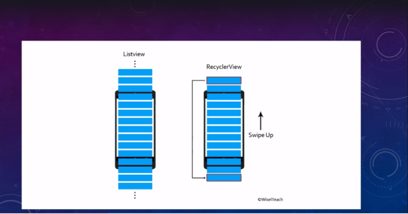

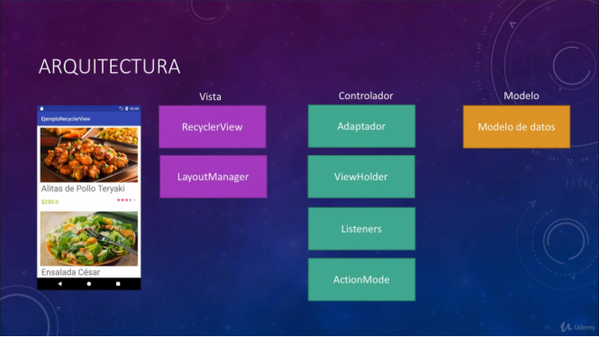

**LayoutManager:** permite configurar en la que se muestran los elementos del Recyclerview

**Adaptador:** enlaza la información (binding de la celda con los elementos xml)

**ViewHolder:** declaramos los objetos que asociamos en el modelo de datos, y reutilizamos las celdas o vistas

**Listeners:** almacena las acciones que se realizan al dar click en los elementos

**ActionMode:** permite seleccionar elementos de la lista y tener opciones o configuraciones a dicionales que no se ven

**Modelo de datos:** une la vista y mapea los datos
## **Interfaz principal**
### **XML:**
```Xml
<?xml version="1.0" encoding="utf-8"?>
<LinearLayout xmlns:android="http://schemas.android.com/apk/res/android"
      xmlns:app="http://schemas.android.com/apk/res-auto"
      xmlns:tools="http://schemas.android.com/tools"
      android:layout_width="match_parent"
      android:layout_height="wrap_content"
      android:orientation="vertical"
      tools:context=".MainActivity">

      <androidx.recyclerview.widget.RecyclerView
          android:id="@+id/lista"
          android:layout_width="match_parent"
          android:layout_height="match_parent" />
</LinearLayout>
```

### **MainActivity:**
```Kotlin
package com.example.mijson

import androidx.appcompat.app.AppCompatActivity
import android.os.Bundle
import android.util.Log
import android.widget.Toast
import androidx.recyclerview.widget.LinearLayoutManager
import androidx.recyclerview.widget.RecyclerView
import com.google.gson.Gson
import okhttp3.Call
import okhttp3.OkHttpClient
import okhttp3.Response
import java.io.IOException
import java.lang.Exception

class MainActivity : AppCompatActivity() {

      var lista:RecyclerView ?= null
      val personajes = ArrayList<Personaje>()
      var adaptador = AdaptadorCustom(this, personajes)
      var layoutManager:RecyclerView.LayoutManager ?= null


      override fun onCreate(savedInstanceState: Bundle?) {
          super.onCreate(savedInstanceState)
          setContentView(R.layout.*activity_main*)


          if (ValidarR.hayRed(this)){
              //solicitudHTTP("http://10.0.0.5/JSON/clientes.json")
              solicitudHTTP("https://personajesmalcolm.000webhostapp.com/clientes.json")
          }else{
              Toast.makeText(this, "No hay red", Toast.*LENGTH_LONG*).show()
          }
      }

      private fun agregarPersonaje(nombre: String, edad: String, genero: String, email: String, localidad:String, telefono: String){
          personajes.add(Personaje("$nombre", "$edad", "$genero", "$email", "$localidad", "$telefono" ))
      }

      private fun solicitudHTTP(url:String){
          val cliente = OkHttpClient()
          val solicitud = okhttp3.Request.Builder().url(url).build()

          cliente.newCall(solicitud).enqueue(object: okhttp3.Callback{
              override fun onFailure(call: Call?, e: IOException?) {
                  //el error
                  Log.e("El error ", "sin respuesta")
              }

              override fun onResponse(call: Call?, response: Response) {
                  var result = response.body().string()
                  //Log.d("Json crudo ", result)

                  //con esto el código que vaya debajo, vuelvo a pasar al thread principal del aplicativo
                  //y ejecute el código que defina
                  this@MainActivity.runOnUiThread {
                      if (response.isSuccessful()){
                      try {
                          val gson = Gson()
                          val res = gson.fromJson(result, Contact::class.*java*)

                          var tamaño= res.Contactos.size
                          for (i in 0..(tamaño-1)){
                              agregarPersonaje(
                                  "${res.Contactos.get(i).nombre}",
                                  "${res.Contactos.get(i).edad}",
                                  "${res.Contactos.get(i).genero}",
                                  "${res.Contactos.get(i).email}",
                                  "${res.Contactos.get(i).localidad}",
                                  "${res.Contactos.get(i).telefono}"
                              )

                              /*Log.d("Personaje $i",
                                      personajes.get(i).nombre + ", "
                                              + personajes.get(i).edad + ", "
                              + personajes.get(i).genero + ", "
                              + personajes.get(i).email + ", "
                              + personajes.get(i).localidad + ", "
                                              + personajes.get(i).telefono
                              )*/

                          }
                          inflar()
                      } catch (e: Exception){

                      }
                  } else{ Log.e("El error ", "No se pudo conectar") }
                  }
              }
          })
      }

      //esto conecta los elementos de la interfaz con el template
      private fun inflar(){
          //aquí configuro el recycler View
          lista = findViewById(R.id.*lista*)
          lista?.setHasFixedSize(true)
          layoutManager = LinearLayoutManager(this)
          lista?.*layoutManager* = layoutManager
          adaptador = AdaptadorCustom(this, personajes)
          lista?.*adapter* = adaptador
          //Log.d("lista","paso la lista")
      }
}
```
### **AdaptadorCustom:**
```Kotlin
package com.example.mijson

import android.content.Context
import android.util.Log
import android.view.LayoutInflater
import android.view.View
import android.view.ViewGroup
import android.widget.ImageView
import android.widget.TextView
import androidx.recyclerview.widget.RecyclerView

class AdaptadorCustom(var contexto:Context, items:ArrayList<Personaje>): RecyclerView.Adapter<AdaptadorCustom.ViewHolder>(){

      var items: ArrayList<Personaje> ?= null

      init {
          this.items = items
      }

      //crea el view holder y mete el archivo xml a la vista
      override fun onCreateViewHolder(parent: ViewGroup, viewType: Int): AdaptadorCustom.ViewHolder {
          val vista = LayoutInflater.from(contexto).inflate(R.layout.*templatepersonajes*, parent, false)
          val viewHolder = ViewHolder(vista)
          //Log.d("onCreateViewHolder ","pasó")
          return viewHolder
      }

      override fun onBindViewHolder(holder: AdaptadorCustom.ViewHolder, position: Int) {
          val item = items?.get(position)
          holder.nombre?.*text* = "Nombre: " +item?.nombre
          holder.edad?.*text* = "Edad: "+ item?.edad
          holder.genero?.*text* = "Genero: "+ item?.genero
          holder.email?.*text* = "Email: "+ item?.email
          holder.localidad?.*text* = "Localidad: "+ item?.localidad
          holder.telefono?.*text* = "Teléfono: "+ item?.telefono

          when(item?.nombre){
              "Craig" -> holder.foto?.setImageResource(R.drawable.*craig*)
              "Malcom" -> holder.foto?.setImageResource(R.drawable.*malcom*)
              "Francis" -> holder.foto?.setImageResource(R.drawable.*francis*)
              "Reese" -> holder.foto?.setImageResource(R.drawable.*reese*)
              "Dewey" -> holder.foto?.setImageResource(R.drawable.*dewey*)
              "Jamie" -> holder.foto?.setImageResource(R.drawable.*jamie*)
              "Stevie" -> holder.foto?.setImageResource(R.drawable.*stevie*)
              "Louis" -> holder.foto?.setImageResource(R.drawable.*louis*)
              "Hal" -> holder.foto?.setImageResource(R.drawable.*hal*)
              "Ida" -> holder.foto?.setImageResource(R.drawable.*ida*)
              else -> holder.foto?.setImageResource(R.drawable.*khe*)
          }
          //Log.d("onBindViewHolder ","pasó")
      }

      override fun getItemCount(): Int {
          return items?.*count*()!!
          //Log.d("getItemCount","pasó")
      }

      class ViewHolder(vista:View): RecyclerView.ViewHolder(vista){
          var vista = vista
          var foto:ImageView ?= null
          var nombre:TextView ?= null
          var edad:TextView ?= null
          var genero:TextView ?= null
          var email:TextView ?= null
          var localidad:TextView ?= null
          var telefono:TextView ?= null

          init {
              foto = vista.findViewById(R.id.*Foto*)
              nombre = vista.findViewById(R.id.*ETNombre*)
              edad = vista.findViewById(R.id.*ETEdad*)
              genero = vista.findViewById(R.id.*ETGenero*)
              email = vista.findViewById(R.id.*ETEmail*)
              localidad = vista.findViewById(R.id.*ETLocalidad*)
              telefono = vista.findViewById(R.id.*ETTelefono*)
          }
      }
}
```

### **Templatepersonajes:**
```Xml
<?xml version="1.0" encoding="utf-8"?>
<LinearLayout xmlns:android="http://schemas.android.com/apk/res/android"
      xmlns:app="http://schemas.android.com/apk/res-auto"
      xmlns:tools="http://schemas.android.com/tools"
      android:layout_width="match_parent"
      android:layout_height="wrap_content"
      android:orientation="vertical">

      <ImageView
          android:id="@+id/Foto"
          android:layout_width="match_parent"
          android:layout_height="wrap_content"
          android:layout_marginTop="5dp"
          android:layout_marginBottom="5dp"
          android:contentDescription="@string/todo"
          tools:srcCompat="@drawable/craig" />

      <TextView
          android:id="@+id/ETNombre"
          android:layout_width="match_parent"
          android:layout_height="wrap_content"
          android:layout_weight="1"
          android:text="@string/nombre"
          android:textColor="@color/black" />

      <TextView
          android:id="@+id/ETEdad"
          android:layout_width="match_parent"
          android:layout_height="wrap_content"
          android:layout_weight="1"
          android:text="@string/edad"
          android:textColor="@color/black" />

      <TextView
          android:id="@+id/ETGenero"
          android:layout_width="match_parent"
          android:layout_height="wrap_content"
          android:layout_weight="1"
          android:text="@string/genero"
          android:textColor="@color/black" />

      <TextView
          android:id="@+id/ETEmail"
          android:layout_width="match_parent"
          android:layout_height="wrap_content"
          android:layout_weight="1"
          android:text="@string/email"
          android:textColor="@color/black" />

      <TextView
          android:id="@+id/ETLocalidad"
          android:layout_width="match_parent"
          android:layout_height="wrap_content"
          android:layout_weight="1"
          android:text="@string/localidad"
          android:textColor="@color/black" />

      <TextView
          android:id="@+id/ETTelefono"
          android:layout_width="match_parent"
          android:layout_height="wrap_content"
          android:layout_marginBottom="10dp"
          android:layout_weight="1"
          android:text="@string/tel_fono"
          android:textColor="@color/black" />

</LinearLayout>
```

### **Contact:**
```Kotlin
package com.example.mijson

data class Contact(
      val Contactos: List<ContactoX>
)
```
### **ContactoX:**
```Kotlin
package com.example.mijson

data class ContactoX(
      val edad: String,
      val email: String,
      val genero: String,
      val localidad: String,
      val nombre: String,
      val telefono: String
)
```

### **ValidarR:**
```Kotlin
package com.example.mijson

import android.content.Context
import android.net.ConnectivityManager
import androidx.appcompat.app.AppCompatActivity


@Suppress("DEPRECATION")
class ValidarR {
      companion object{
          fun hayRed(activity:AppCompatActivity):Boolean{
              val connectivityManager = activity.getSystemService(Context.*CONNECTIVITY_SERVICE*) as ConnectivityManager
              val networkInfo = connectivityManager.*activeNetworkInfo*
              return networkInfo != null && networkInfo.*isConnected*
          }
      }
}
```

### **Personaje:**
```Kotlin
package com.example.mijson

class Personaje(nombre:String, edad:String, genero:String, email:String, localidad:String, telefono:String) {

      var nombre = ""
      var edad = ""
      var genero = ""
      var email = ""
      var localidad = ""
      var telefono = ""

      init {
          this.nombre = nombre
          this.edad = edad
          this.genero = genero
          this.email = email
          this.localidad = localidad
          this.telefono = telefono
      }
}
```

### **Permisos del manifest:**
```xml
<?xml version="1.0" encoding="utf-8"?>
<manifest xmlns:android="http://schemas.android.com/apk/res/android"
      package="com.example.mijson">
      <!--Con esto doy acceso al wifi-->
      <uses-permission android:name="android.permission.ACCESS_NETWORK_STATE"/>
      <!--Con esto doy acceso a Internet-->
      <uses-permission android:name="android.permission.INTERNET"/>

      <application
          android:allowBackup="true"
          android:icon="@mipmap/ic_launcher"
          android:label="@string/app_name"
          android:roundIcon="@mipmap/ic_launcher_round"
          android:supportsRtl="true"
          android:theme="@style/Theme.MiJSON"
          android:usesCleartextTraffic="true">
          <activity android:name=".MainActivity">
              <intent-filter>
                  <action android:name="android.intent.action.MAIN" />

                  <category android:name="android.intent.category.LAUNCHER" />
              </intent-filter>
          </activity>
      </application>

</manifest>
```

**Ciclos de Vida de una aplicación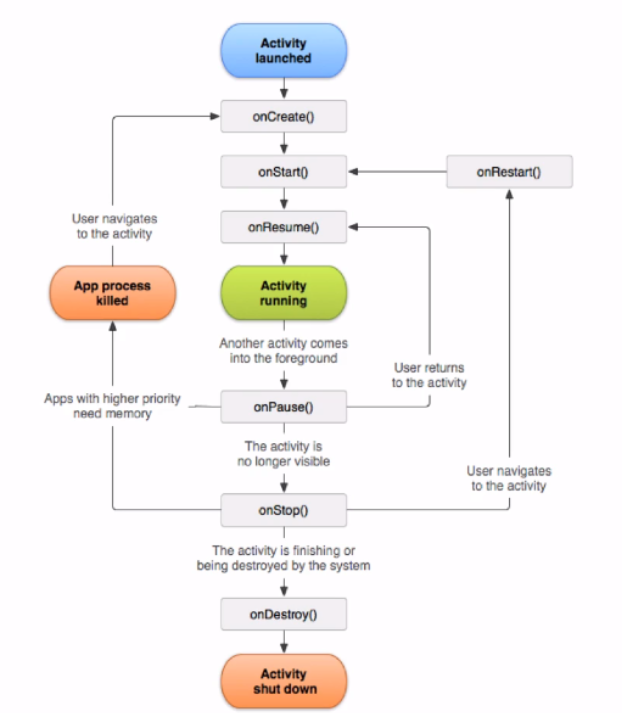**

**onCreate:** es el primer estado que se ejecuta el iniciar una app, aquí suelen declararse las variables o valores iniciales.

**onStart:** cuando ya se inicializa la interfaz gráfica de la aplicación, a partir de aquí se puede interactuar con el resto de ciclos de vida de la app.

**onResume:** se vuelve visibles la aplicación y la vista para el usuarios.

**Activity running:** Ya está ejecutándose como normalmente lo haría una aplicación

**onPause:** se ejecuta cuando una aplicación va a pasar a segundo plano y en primer plano aparece una nueva aplicación, así se le notifica al sistema operativo para que se prepare para mandar la aplicación al fondo.

**onStop:** no se destruye la app, pero Android aún conserva un pedazo de memoria dedicado para la aplicación.

**onRestart:** se activa cuando uno pasa del segundo plano, a primer plano una aplicación y se inicializa

**App process killed:** cuando hay otras apps con mayor prioridad en el uso de la memoria, se elimina el proceso que conservaba en memoria la aplicación

**onDestroy:** la actividad es finalizada o está siendo destruida por el sistema 
# **Base de datos nativa en Android**
**Contract/esquema:** estructura las tablas de la base de datos o de solamente una tabla

**Database Helper:** Realiza las operaciones de creación y actualización de base de datos

**Alumno:** sirve como clase para ir creando los objetos utilizados en la base de datos

**AlumnosCRUD:** permite crear y utilizar las operaciones CRUD de la base de datos.

## **ViewModel**
Crear una variable viewmodel dentro de las activitys o fragments:

```Kotlin
lateinit var sumarViewModel: SumarViewModel

//esta variable de tipo viewmodel especifica que la activity o fragment a la que pertenece(this) y luego a que clase
//viewmodel pertenece (SumarViewModel)
sumarViewModel = ViewModelProviders.of(this).get(SumarViewModel::class.*java*)
```

Clases que heredan de ViewModel Ej. 1:
```Kotlin
//se declara que la clase SumarViewModel hereda de la clase ViewModel
class SumarViewModel: ViewModel() {

      //esta variable se copia tal cual de la activity ViewModelActivity
      var resultado: Int = 0
}
```

Clases que heredan de ViewModel Ej. 2:
```Kotlin
//se declara que la clase UserViewModel hereda de la clase ViewModel
class UserViewModel: ViewModel {

      //esta variable tiene el mismo nombre a su similar en la activity UserViewModelActivity
      var userList: MutableList<User>

      constructor(){
          userList = ArrayList()
      }

      //con esta función se agregan datos al array
      fun addUsuer(user: User){
          userList.add(user)
      }
}
```

# **Comparación de LiveData, Flow, StateFlow, y SharedFlow**
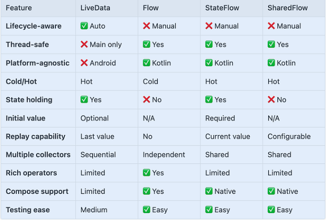
## **LiveData vs StateFlow**
### LIVEDATA**	
- **Consciente del ciclo de vida:** Se detiene/reanuda automáticamente en función del estado del ciclo de vida
- **Enfocado en IU:** Diseñado específicamente para componente de la IU para Android
- **Solamente en el hilo principal:** Los observadores funcionand en el hilo principal
- **Chismoso:** Siempre emite el último valor a los nuevos observadores
### **STATEFLOW**
- **No es consciente del ciclo de vida:** Requiere del control manual del ciclo de vida.
- **Basado en corrutinas:** Forma parte del ecosistema de corrutinas de Kotlin
- **A prueba de hilos:** Puede emitir de cualquier hilos.
- **Compatibilidad con Compose:** Funciona mejor con compose y patrones de diseño reactivos modernos
- **Flujo de acceso rápido:** Siempre activo, no se detiene automáticamente
- **Corrutinas y testing:** tiene un mejor soporte para testing e integración de corrutinas que LiveData
## **LiveData vs Flows**
### **LIVEDATA**
- **Consciente del ciclo de vida:** Controla automáticamente el ciclo de vida de Android
- **Centrado en la IU:** Diseñado para la capa de IU de Android.
- **Hilo principal:** Observadores se ejecutan en el hilo principal.
- **Dependencias Android:** Forma parte de los componentes de arquitectura de Android.
- **Emisión de datos:** Un solo valor
- **Soporte de plataforma:** Específico de Android
- **Modelo de ejecución:** Caliente (siempre está activo).
- **Operadores:** Operadores límitados.
- **Mejor capa:** Capa de IU
- **Cuando usar:** Estados de la IU que necesitan estar conscientes del comportamiento del ciclo de vida.
### **FLOW**
- **No es consciente del ciclo de vida:** Es Kotlin puro y no controla el ciclo de vida de Android. Controla el ciclo de vida manualmente.
- **Flujo de valores:** Puede emitir multiples valores a lo largo del tiempo
- **Es frío por defecto:** Solo se activa cuando es recolectado
- **Cualquier Hilo:** A prueba de hilos, puede cambiar de contextos
- **Operadores poderosos:** Set rico de operadores de transformación
- **Emisión de datos:** Flujo de valores.
- **Soporte de plataforma:** Plataforma agnóstico de Kotlin
- **Modelo de ejecución:** Frío (Perezoso).
- **Operadores:** Set rico de operadores.
- **Mejor capa:** Capa de Datos/Negocio (propositos generales de kotlin para flujos reactivos y multiplataforma).
- **Cuando usar:** Flujos de datos, capa de repositorio, tranformacioens complejas, proyectos que no son de android.
## **LiveData vs SharedFlow**
### **LIVEDATA**
- **Lifecycle-aware:** gestiona automáticamente el ciclo de vida de Android
- **Tenedor del estado:** Tiene valor actual, los nuevos observadores obtienen el último valor
- **Valor único:** Un valor a la vez
- **Enfocado en la interfaz de usuario:** Diseñado para componentes de interfaz de usuario
- **Manejo automático del ciclo de vida:** pausas/resumen con ciclo de vida
- **Naturaleza de los datos:** Recipiente de estado (pegajoso).
- **Control del ciclo de vida:** Consciente del ciclo de vida.
- **Observadores:** Patrón de un solo observador.
- **Valor inicial:** Siempre tiene el valor actual.
- **Enfoque:** Enfocado en la IU.
- **Plataforma:** Específico de android.
- **Cuando usar:** El estado de la IU que necesita persistencia (perfil de usuario, estado de carga).
### **SHAREDFLOW**
- **No tiene conocimiento del ciclo de vida:** Requiere el manejo manual del ciclo de vida
- **Flujo de eventos:** Diseñado para eventos/acciones, no estado
- **Transmisión en caliente:** Siempre activo, múltiples suscriptores
- **Configurable:** Puede reproducir eventos, valores de búfer
- **Sin valor inicial:** A diferencia de StateFlow, no mantiene el estado
- **Naturaleza de los datos:** Flujo de eventos (no es pegajoso)
- **Control del ciclo de vida:** Control manual del ciclo de vida.
- **Observadores:** Multiples subscriptores.
- **Valor inicial:** No tiene un valor inicial.
- **Enfoque:** Enfocado en acciones y eventos.
- **Plataforma:** Independiente de plataformas.
- **Cuando usar:** Un evento a la vez (navegación, toasts, snackbars, clicks de botón).
## Flow vs StateFlow
### Flow
- **Flujo frío:** Solo activo cuando se recolecta, cada colector recibe su propio flujo.
- **Sin recipiente de estado:** no almacena el valor actual
- **Emisiones múltiples:** puede emitir una secuencia de valores a lo largo del tiempo
- **Lazy:** Inicia la ejecución cuando se recolecta
- **Uno a uno:** cada recolector obtiene ejecución independiente.
- **Modelo de ejecución:** Frío (perezoso)
- **Caso de uso:** Flujo de datos, operaciones de información, llamadas a API, queries de bases de datos, transformaciones.
- **Ciclo de vida:** Empieza en la recolección.
### StateFlow
- **Flujo caliente:** Siempre activo, compartido entre los recolectores
- **Recipiente de estado:** Siempre tiene el valor actual
- **Mezclado:** Solo importa el valor más reciente, cae valores intermedios
- **Pegajoso:** Los nuevos recolectores obtienen inmediatamente el valor actual
- **Uno-a-muchos:** Ejecución única, múltiples suscriptores
- **Modelo de ejecución:** Caliente (siempre activo)
- **Caso de uso:** Gestión de estado, estados de IU, configuraciones, Información actual de usuario, estado de la app.
- **Ciclo de vida:** Siempre está ejecutándose.
## **Flow vs SharedFlow**
### **Flow**
- **Flujo en frío:** solo se ejecuta cuando se recopila, cada colector obtiene ejecución independiente
- **Uno a uno:** Cada colector desencadena ejecución separada
- **Perezoso:** No comienza hasta que se recoge
- **Secuencial:** Valores emitidos secuencialmente a cada colector
- **Procesamiento de datos:** Mejor para las transformaciones y operaciones de datos
- **Comportamiento del recolector:** Independiente por recolector.
- **Uso primario:** Procesamiento/Transformación de información
- **Ciclo de vida:** Empieza en la recolección
- **Capacidad de repetición:** Sin capacidad de repetición.
- **Manejo de la contrapresión:** Manejo de la contrapresión
- **Caso de uso:** Operaciones de información, llamadas API, queries de base de datos, transformaciones, capa de repositorio.
### **SharedFlow**
- **Flujo de acceso rápido:** siempre activo, ejecución compartida entre los coleccionistas
- **Uno-a-muchos:** Ejecución única, múltiples suscriptores
- **Transmisión de eventos:** Diseñado para transmitir eventos
- **Configurable:** Puede reproducir eventos, valores de búfer
- **Sin contrapresión:** Utiliza el buffer con estrategias de desbordamiento
- **Comportamiento del recolector:** Compartido entre recolectores.
- **Uso primario:** Transmisión de eventos.
- **Ciclo de vida:** siempre está en ejecución
- **Capacidad de repetición:** Repetición configurable.
- **Manejo de contrapresión:** Basado en Búfer
- **Caso de uso:** Eventos, Notificaciones, User actions, Navigation events, global broadcasts.
## **StateFlow vs SharedFlow**
### **StateFlow**
- **Titular del estado:** Siempre tiene el valor actual, representa el estado
- **Conflado:** Solo importa el valor más reciente, los valores intermedios se eliminan
- **Valor inicial requerido:** Debe proporcionar el estado inicial
- **Comportamiento pegajoso:** los nuevos coleccionistas obtienen inmediatamente el valor actual
- **Gestión del estado:** Diseñado para la gestión de la interfaz de usuario/estado de la aplicación
- **Naturaleza de los datos:** Recipiente del estado (pegajoso)
- **Valor actual:** Siempre tiene el valor actual
- **Caso de uso primario:** Gestión del estado IU
- **Comportamiento de nuevos observadores:** Los nuevos observadores obtienen el estado actual.
- **Cuando usarse:** estado de la IU (estados de carga, éxito, error), configuración de información, Información actual de usuarios, Formulario de datos, algún dato que represente el estado actual.
### **SharedFlow**
- **Flujo de eventos:** Diseñado para eventos/acciones, no estado
- **No se combina:** Todos los eventos emitidos se entregan (a menos que se desborde el búfer)
- **Sin valor inicial:** Comienza vacío, solo emite cuando se activa
- **Impulsados por eventos:** Los nuevos coleccionistas no tienen eventos anteriores (a menos que se configuren la repetición)
- **Acciones de una sola vez:** Perfecto para la navegación, tostadas, efectos secundarios
- **Naturaleza de los datos:** Flujo de eventos (No es pegajoso)
- **Valor actual:** Sin valor inicial
- **Caso de uso primario**: Acciones/Eventos de una sola vez
- **Comportamiento de nuevos observadores:** Los nuevos observadores obtienen solamente los eventos futuros.
- **Cuando usarse:** Eventos de navegación, mensajes Toast/Snackbar, Eventos del botón click, resultado de llamadas a API (Notificaciones de Exito/error), acciones o eventos de una sola vez.
## **Resumen de la guía de uso**
### **Cuando usar LiveData**
- Construcción de interfaz de usuario tradicional de Android (Vistas, no Componer)
- ¿Necesita una gestión automática del ciclo de vida
- Observación de estado simple
- Trabajar con componentes de arquitectura existentes
### **Cuando usar Flow**
- Tratamiento y transformaciones de datos
- Operaciones de capa de repositorio
- Consultas de base de datos
- Cadenas de llamadas API
- Secuencias de operadores complejas
- ¿Necesitas una ejecución perezosa
### **Cuando usar StateFlow**
- Gestión del estado de la interfaz de usuario con Compose
- Estado de configuración de la aplicación
- Datos de usuario actuales
- Estado de la forma
- Cualquier estado que debe persistir
- ¿Necesita actualizaciones de estado seguras para los hilos
### **Cuando usar SharedFlow**
- Eventos de una sola vez (navegación, tostadas)
- Transmisión de eventos
- Acciones de usuario
- Efectos secundarios
- Necesidad de notificar a varios observadores
- No se requiere persistencia estatal


# **LiveData**
Crear una variable viewmodel dentro de las activitys o fragments:
```Kotlin
//esta variable es la del viewModel
lateinit var viewModel: LiveDataViewModel

//aquí designamos de que activity es y que viewmodel usa
   viewModel = ViewModelProviders.of(this).get(LiveDataViewModel::class.*java*)
```

El observer dentro de las activitys o fragments:

```Kotlin
val listObserver = *Observer*<List<User>>{
      //esto va agregando la información a la etiqueta
      userList ->
      var texto = ""
      for (user in userList){
          texto += user.nombre + " " + user.edad + "n"
      }
      tvLiveData.*text* = texto
}
```

Suscribir el viewmodel al observer dentro de las activitys o fragments:
```Kotlin
//esto suscribe el observer, se pone:
// el viewmodel, el nombre de la función que lee, la activity en la que está y el nombre del observer
viewModel.getUserList().observe(this@LiveDataActivity, listObserver)
```

Los objetos observables dentro del ViewModel:
```Kotlin
//este es un objeto del tipo MutableLiveData, es un objeto observable
var userListLiveData: MutableLiveData<List<User>> = MutableLiveData()

//esta es una lista mutable pero sin ser livedata, es  solo una lista de usuarios
var userList: MutableList<User> = ArrayList()

//esta función solo es de lectura
fun getUserList(): LiveData<List<User>>{
      return userListLiveData
}

//con esto le doy un valor a la lista del livedata usando una lista normal
userListLiveData.*value* = userList
```

# **Databinding**
Habilitar el databinding desde la clase build.gradle :app dentro de las llaves de Android:
```Kotlin
//esto habilita el dataBinding
dataBinding {
      enabled = true
}
```

El DataBinding dentro del xml de la interfaz gráfica:
```Xml
<?xml version="1.0" encoding="utf-8"?>
<layout xmlns:android="http://schemas.android.com/apk/res/android"
          xmlns:tools="http://schemas.android.com/tools"
          xmlns:app="http://schemas.android.com/apk/res-auto">
      <!-- esto convierte el layout a databinding-->
      <data>
          <!-- //esta es la variable del databinding y su nombre es el mismo que el objeto en la activity,
          el type tiene la misma ubicación que la importación del user de la actividad, ósea que usa la clase User de la carpeta utils para crear el objeto databinding en el xml-->
          <variable
                  name="user"
                  type="com.androiddesdecero.viewmodellivedatakotlin.utils.User"/>
      </data>

      <LinearLayout
              android:layout_width="match_parent"
              android:layout_height="match_parent"
              tools:context=".ui.DataBindingActivity">
          <!--en los textos de los textviews manda a llamar las variables del objeto user-->
          <TextView
                  android:text="@{user.nombre}"
                  android:layout_width="wrap_content"
                  android:layout_height="wrap_content"/>
          <TextView
                  android:text="@{user.edad}"
                  android:layout_width="wrap_content"
                  android:layout_height="wrap_content"/>

      </LinearLayout>
</layout>
```

Variable para ingresar datos dentro del xml de la interfaz, va dentro de la activity o fragment y tienes que remover el setContetView del onCreate:
```Kotlin
super.onCreate(savedInstanceState)
//setContentView(R.layout.activity_data_binding)

//esta variable es para setContent pero usando dataBinding,
//android estudio creo este tipo de variabl así: Activity*nombre de la activity*Binding
//y para **la** parte del setContentView se compone así: this@*nombre completo del archivo activity*, *ubicación del layout de la activity*
val binding: ActivityDataBindingBinding = DataBindingUtil.setContentView(this@DataBindingActivity,R.layout.*activity_data_binding*)


//objeto de tipo User
lateinit var user: User
user = User("Alberto", "30")

//esto sirve por ejemplo cuando haces solicitudes constantes a un webservice y las respuestas
//están constantemente cambiando, con esto se actualizan y muestran los nuevos cambios
binding.*user* = user

Esta es la clase User de la cual se estuvieron haciendo los objetos DataBinding:

class User(
      var nombre: String = "",
      var edad: String = "")
```

## **DataBinding LiveData BindingAdapter**
Las declaraciones del lado de la activity:
```Kotlin
//esta es la variable del viewModel
lateinit var viewModel: DBLDViewModel

override fun onCreate(savedInstanceState: Bundle?) {
      super.onCreate(savedInstanceState)

      //la variable del databinding con la que se ingresa el contenido a la vista
      val binding: ActivityDbldBinding = DataBindingUtil.setContentView(this@DBLDActivity, R.layout.*activity_dbld*)

      //esto declara el propietario del ciclo de vida
      binding.setLifecycleOwner(this)

      //con esto se instancia el viewModel
      viewModel =ViewModelProviders.of(this).get(DBLDViewModel::class.*java*)

      //esto vienen en el segundo video
      //asigna el viewmodel del xml a la variable viewModel de arriba
      binding.*viewModel* = viewModel

      val user = User("Alberto", "30")
      viewModel.setUser(user)

}
```

El databinding del lado del xml:
```Xml
<?xml version="1.0" encoding="utf-8"?>
<layout xmlns:android="http://schemas.android.com/apk/res/android"
          xmlns:tools="http://schemas.android.com/tools"
          xmlns:app="http://schemas.android.com/apk/res-auto">
      <!--esto convierte al layout en databiding-->
      <data>
      <!--esto le da un nombre a la variable y el type especifica con que viewModel está relacionado-->
          <variable
`             `name="viewModel"
`             `type="com.androiddesdecero.viewmodellivedatakotlin.viewmodel.DBLDViewModel"/>
      </data>

.

.

.

.


<!--esto enlaza el texto con la variable del objeto user. La visibilidad y tamaño lo tiene asociado
al bindingAdapter. el visibility es exactamente el mismo que el del bindingadapter-->
<TextView
          android:text="@{viewModel.user.nombre}"
          android:layout_width="wrap_content"
          android:layout_height="wrap_content"
          app:visibility="@{viewModel.visible}"
          app:size="@{viewModel.size}"/>

<!--esto enlaza el texto con la variable del objeto user. La visibilidad y tamaño lo tiene asociado
al bindingAdapter. el visibility es exactamente el mismo que el del bindingadapter-->
<TextView
          android:text="@{viewModel.user.edad}"
          android:layout_width="wrap_content"
          android:layout_height="wrap_content"
          app:visibility="@{viewModel.visible}"
          app:size="@{viewModel.size}"/>


<!--esto enlaza el texto con la función updateUser del viewmodel al botón-->
<Button
          android:onClick="@{()->viewModel.updateUser()}"
          android:text="Actualizar User"
          android:layout_width="wrap_content"
          android:layout_height="wrap_content"/>

<!--esto enlaza el texto con la función changeVisibility del viewmodel al botón-->
<Button
          android:text="Visibilidad"
          android:onClick="@{()->viewModel.changeVisibility()}"
          android:layout_width="wrap_content"
          android:layout_height="wrap_content"/>
```

El viewModel: 
```Kotlin
//esta clase desciente de ViewModel
class DBLDViewModel: ViewModel() {

      //una variable livedata que cambia
      var user: MutableLiveData<User> = MutableLiveData()
      //esto maneja la visibilidad de las textview de la interfaz
      var visible: MutableLiveData<Boolean> = MutableLiveData()
      //esta variable es para controlar el tamaño de las textView
      var size: MutableLiveData<Float> = MutableLiveData(14f)


      //esto le ingresa los valores al observador
      fun setUser(user: User){
          this.user.*value* = user
      }
      //esto actualiza el valor del objeto
      fun updateUser(){
          val user = User("Laura", "23")
          this.user.*value* = user
      }

      fun setVisible(visible: Boolean){
          this.visible.*value* = visible
      }

      fun changeVisibility(){
          if(visible.*value* == true){
              visible.*value* = false
          }else{
              visible.*value* = true
          }
          size.*value* = size.*value*!!.toFloat() + 5f
      }
}
```

La Clase User con la cual se hicieron los objetos del databinding:
```Kotlin
class User(
      var nombre: String = "",
      var edad: String = "")

el objeto BindingAdapter para controlar la visibilidad de los textview y el tamaño de la fuente:

object BindingAdapter {

      //esta etiqueta se usa por que los bindingAdapter se basan en métodos estáticos
      @JvmStatic
      //esto controla la visibilidad de la interfaz y está asociado a los textview de la interfaz
      @BindingAdapter("visible")
      fun setVisibility(view: View, visibility: Boolean){
          if(visibility == true){
              view.*visibility* = View.*VISIBLE*
          }else{
              view.*visibility* = View.*GONE*
          }
      }

      //esta etiqueta se usa por que los bindingAdapter se basan en métodos estáticos
      @JvmStatic
      //esto controla la visibilidad de la interfaz y está asociado a los textview de la interfaz
      @BindingAdapter("visibility", "size")
      fun setSizeAndVisibility(view: TextView, visibility: Boolean, size: Float){
          if(visibility == true){
              view.*visibility* = View.*VISIBLE*
          }else{
              view.*visibility* = View.*GONE*
          }
          view.*textSize* = size
      }
}
```

Habilitar el buildAdapter para el proyecto desde el archivo build.graddle(:app):
```Kotlin
//esto lo agregué para el buildingAdapter va al principio del build.graddle
apply plugin: 'kotlin-kapt'
```
# **Crear un archivo object:**
```Kotlin
object Sumar {

      fun sumar(numero: Int): Int{
          var numero = numero
          numero = numero + 1
          return numero
      }
}
```

# **Fragment**
Agregar un fragment al xml de una activity
```xml
<fragment
      android:layout_width="match_parent"
      android:layout_height="wrap_content"
      android:id="@+id/fragment1"
      android:name=*ubicación de la activity*
      tools:layout=*ubicación del xml* />
```

Comunicación entre fragmentos:
```Kotlin
//esto es del lado del fragment

var listener: NombreListener ?= null

var nombre:EditText ?= null


val nombreActual = nombre?.*text*.toString()
listener?.obtenerNombre(nombreActual)

//video 259
interface NombreListener{
      fun obtenerNombre(nombre:String){

      }
}

override fun onAttach(context: Context) {
      super.onAttach(context)

      try {
          listener = context as NombreListener
      } catch (e: ClassCastException){
          throw ClassCastException(context.toString() + "debes implementar la interfaz")
      }

}


//esto es del lado de la activity que usa el fragment

class MainActivity : AppCompatActivity(), *nombre del fragment*.*nombre de la interfaz del fragment*{

      //video 259
      var nombreActual:TextView ?= null

      override fun onCreate(savedInstanceState: Bundle?) {
          super.onCreate(savedInstanceState)
          setContentView(R.layout.*activity_main*)

          //video 259
          nombreActual = findViewById(R.id.*tvNombre*)
      }

      override fun obtenerNombre(nombre: String) {
          super.obtenerNombre(nombre)
          nombreActual?.*text* = nombre
      }
}
```

Mostrar dinámicamente un fragmento dentro de una activity
```Kotlin
var bAdd:Button ?= null

bAdd = findViewById(R.id.*bAdd*)

val fragmentManager = *supportFragmentManager*

bAdd?.setOnClickListener {
      val fragmentTransaction = fragmentManager.beginTransaction()

      val nuevoFragmento = MiFragmento()
      fragmentTransaction.add(R.id.*container*, nuevoFragmento)

      //con esta linea se puede ocultar el fragmento mostrado solo dandole al botón de back
      fragmentTransaction.addToBackStack(null)

      fragmentTransaction.commit()
}
```

Ocultar el fragmento dentro de una interfaz
```kotlin
var bReplace : Button ?= null

val fragmentManager = *supportFragmentManager*

bReplace = findViewById(R.id.*bReplace*)
bReplace?.setOnClickListener {
      val fragmentTransaction = fragmentManager.beginTransaction()

      val nuevoFragmento = Componente2()
      fragmentTransaction.replace(R.id.*container*, nuevoFragmento)

      //con esta linea se puede ocultar el fragmento mostrado solo dandole al botón de back
      fragmentTransaction.addToBackStack(null)
      fragmentTransaction.commit()
}
```

# **AlertDialog**
La clase AlertDialog nos permite construir una variedad de diseños de diálogo. Como se muestra en la figura, hay tres regiones de un diálogo de alerta como title  y . estos son arreglados por el androide. Y esta ventana se puede cambiar de tamaño con el contenido.** content** areaaction buttons

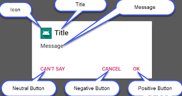

1. **Título:** esto es opcional y debe usarse solo cuando el área de contenido está ocupada por un mensaje detallado, una lista o un diseño personalizado.
1. **Área de contenido:** puede mostrar un mensaje, una lista u otro diseño personalizado.
1. **Botones de acción:** no debe haber más de tres botones de acción en un cuadro de diálogo. podemos usar uno, dos o tres botones juntos.

**Botón Positivo:** Debemos usarlo para aceptar y continuar con la acción (la acción "Aceptar").

**Botón negativo:** deberíamos usarlo para cancelar la acción.

**Botón neutral:** deberíamos usar esto cuando el usuario no quiera continuar con la acción, pero no necesariamente quiera cancelar. Aparece entre los botones positivo y negativo. Por ejemplo, la acción podría ser "Recordármelo más tarde". o "no puedo decir".
## **Ejemplo:**
### **Activity:**
```kotlin
class Trazabilidad : AppCompatActivity() {
      private lateinit var binding: ActivityTrazabilidadBinding

      override fun onCreate(savedInstanceState: Bundle?) {
          super.onCreate(savedInstanceState)
          //setContentView(R.layout.activity_trazabilidad)
          binding = ActivityTrazabilidadBinding.inflate(*layoutInflater*)
          setContentView(binding.*root*)


binding.BTSalir.setOnClickListener{
              val builder = AlertDialog.Builder(this)

              builder.setView(R.layout.*fragment_logout*)

              //set positive button
              builder.setNegativeButton(
                  "No"
              ) { dialog, id ->
                  // User cancelled the dialog
              }

              builder.setPositiveButton("Si") { dialog, id ->
              }
              builder.show()
          }
      }
}
```

### **Fragmento:**
```kotlin
class Logout : DialogFragment() {

      private var _binding: FragmentLogoutBinding?= null
      private val binding get() = _binding!!

      override fun onCreate(savedInstanceState: Bundle?) {
          super.onCreate(savedInstanceState)
      }

      override fun onCreateView(
          inflater: LayoutInflater,
          container: ViewGroup?,
          savedInstanceState: Bundle?
      ): View? {
          // Inflate the layout for this fragment
          *dialog*?.*window*?.setBackgroundDrawableResource(R.drawable.*round_corner*)
          _binding = FragmentLogoutBinding.inflate(inflater, container, false)
          val view = binding.*root*
          return  view

          //return inflater.inflate(R.layout.fragment_logout, container, false)
      }

      override fun onStart() {
          super.onStart()
          val width = (*resources*.*displayMetrics*.widthPixels * 0.85).toInt()
          val height = (*resources*.*displayMetrics*.heightPixels * 0.40).toInt()
          *dialog*!!.*window*?.setLayout(width, ViewGroup.LayoutParams.*WRAP_CONTENT*)


      }


      override fun onDestroy() {
          super.onDestroy()
          _binding = null
      }

}
```

### **Fragmento layout:**
```xml
<?xml version="1.0" encoding="utf-8"?>
<LinearLayout xmlns:android="http://schemas.android.com/apk/res/android"
      xmlns:app="http://schemas.android.com/apk/res-auto"
      xmlns:tools="http://schemas.android.com/tools"
      android:layout_width="match_parent"
      android:layout_height="match_parent"
      android:orientation="vertical"
      tools:context=".UI.AlertDialog.Logout">

      <ImageView
          android:id="@+id/imageView9"
          android:layout_width="128dp"
          android:layout_height="157dp"
          android:layout_gravity="center"
          android:layout_marginBottom="16sp"
          android:src="@drawable/ic_baseline_logout_24"
          app:layout_constraintEnd_toEndOf="parent"
          app:layout_constraintStart_toStartOf="parent"
          app:layout_constraintTop_toTopOf="parent" />

      <TextView
          android:id="@+id/textView31"
          android:layout_width="wrap_content"
          android:layout_height="wrap_content"
          android:layout_gravity="center"
          android:layout_marginBottom="16sp"
          android:fontFamily="sans-serif-light"
          android:text="¿Seguro que quieres cerrar sesión?"
          android:textSize="20dp"
          app:layout_constraintEnd_toEndOf="parent"
          app:layout_constraintStart_toStartOf="parent"
          app:layout_constraintTop_toBottomOf="@+id/imageView9" />

</LinearLayout>
```

# **Pila de actividades:**
## **Reiniciar la pila de actividades:**
```kotlin
finish()
startActivity(
      Intent(*baseContext*, SplashScreen::class.*java*)
.addFlags(Intent.*FLAG_ACTIVITY_NEW_TASK* or Intent.*FLAG_ACTIVITY_CLEAR_TASK*)
)
```

## **Cerrar toda la aplicación (java):**
```
//aquí cerramos el actícity actual
      finish();
      //creamos un nuevo intent de action_main para el cierre de todo lo que esté abierto
      Intent intent = new Intent(Intent.ACTION_MAIN);
      intent.addCategory(Intent.CATEGORY_HOME);
      intent.setFlags(Intent.FLAG_ACTIVITY_NEW_TASK);
      startActivity(intent);
```

## **Importaciones**
```Kotlin
// ViewModel and LiveData
implementation 'androidx.lifecycle:lifecycle-extensions:2.1.0'
annotationProcessor 'androidx.lifecycle:lifecycle-compiler:2.1.0'
```

# **ViewBinding**
## **Build.gradle:**
```gradle
android {
...
          viewBinding {
              enabled = true
          }
      }
```

## **Activity:**
```kotlin
      private lateinit var binding: ActivityLoginBinding

      override fun onCreate(savedInstanceState: Bundle) {

super.onCreate(savedInstanceState)
binding = ActivityLoginBinding.inflate(*layoutInflater*)
setContentView(binding.*root*)

      }


```

# **Arquitectura Clean**
La arquitectura clean permite estructurar las partes del código en diversos paquetes y clases, de forma que cada componente se encargue de realizar una única acción e interactuar solamente con el siguiente componente dentro de la arquitectura, sin necesidad de saber qué hace el resto de componentes, ni el cómo. De esta forma se puede identificar fácilmente a que componente consultar, en caso de que ocurra algún error en la ejecución; además de que es mucho más fácil entender el código y garantiza la escalabilidad del proyecto. Con esta arquitectura se recomienda hacer uso de la inyección de dependencias para evitar instanciar los objetos directamente en las clases, esto con el fin de poder hacer uso de Unit Testing.

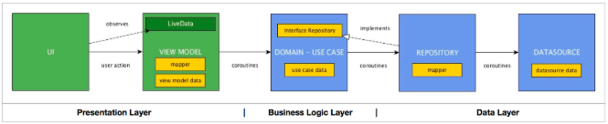
## **Capa de presentación**
Esta capa está enfocada en el usuario, dentro de esta se contiene la interfaz gráfica (captura eventos del usuario y muestra datos) y el ViewModel (realiza operaciones (como verificar que no haya errores) y formatea datos para que muestren de manera determinada); en lugar de usar ViewModel se puede utilizar alguna otra capa que realice lo mismo.

- **Paquete UI:** esta capa se comunica con el ViewModel mediante un objeto ViewModel y observa los LiveData Declarados.
- **Paquete VM:** esta capa crea los livedata que serán observador por la capa UI, esta capa solo se comunica con la capa de UseCase. Para la comunicación con UseCae se instancia un objeto UseCase.

**Capa de la lógica de negocio (UseCase)**

Esta capa establece las reglas que se deben de cumplir. Para ello recibe datos que proporciona el usuario y posteriormente hace las operaciones correspondientes (por ejemplo, puede recibir los datos del repositorio y las operaciones correspondientes sería que dicha información cumpla con los requisitos de la aplicación móvil). Esta es la capa más estable y es la que indica que está ocurriendo en la arquitectura de software. Esta capa se instancia con la capa del repositorio por medio de una interfaz que se encuentra en este mismo paquete, esto se debe a que la capa de lógica de negocio solo puede interactuar con otros paquetes que también sean estables (el repositorio es la capa más inestable).
## **Capa de datos**
En esta capa es donde están los datos y por la que se puede acceder a los mismos. Esta capa está dividida entre el repositorio y el Datasource:

- **Repositorio (RespositoryImpl):** accesa a los datos, por lo tanto, sabe cómo obtener la información y de dónde. Esta capa tiene que importar del paquete Domain/UseCase la interfaz con la que se comunica la capa de lógica de negocio. Esta capa llama a la capa de DataSource, por lo tanto debe instanciarse la clase.
- **Datasource:** realiza la implementación para acceder a los datos, esta capa es la que suele interactuar directamente con la base de datos local o con algún servicio web. Esta capa se suele instanciar con las librerías necesarias para acceder a los datos locales o en la web, para posteriormente consumirlos.
## **Comunicación de las capas**
La comunicación entre cada capa se hace en un solo sentido, y cada capa solamente tiene contacto con una única capa amiga.

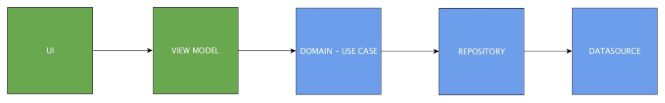
## **Ejemplo de proyecto (Check-eat):**
- ### 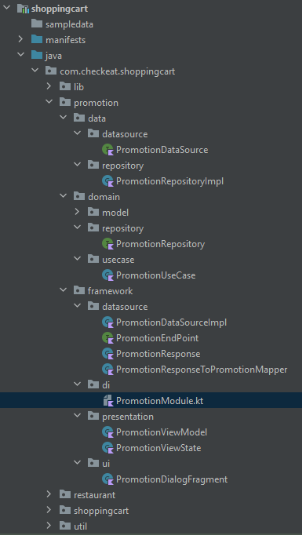
**Data:** 
  - **Datasource:** Contiene las interfaces o firmas que son implementadas en el modelo.
  - **Repository:** Aquí va la clase repositorio, en esta vienen ya las funciones y el como se ejecutan las consultas a la capa de modelo(del patrón de diseño MVVM)

- ### **Domain:** 
  - **Repository:** Esta carpeta contiene las interfaces o firmas que son implementadas en el repositorio.

  - **UseCase:** Contiene los casos de usos que interactúan y ejecutan las consultas a los repositorios.

- ### **Framework:** 
  - **DataSource:** Aquí van las clases del modelo, en esta carpeta se incorporan todas las clases con el comportamiento del modelo.
  - **Di:** En esta carpeta se van almacenando los archivos que contienen las inyecciones de dependencias.
  - **Presentation:** Aquí van el ViewModel y el ViewState (este se encarga del status de las consultas que realiza ViewModel)
  - **Ui:** Aquí van los archivos que se encargan de las interfaces gráficas y la presentación de datos en la interfaz gráfica (activity, Fragment, DialogFragment, etc.)

**Nota:** en este ejemplo las capta de alto nivel son framework, domain y data. También en Framework va para este ejemplo contiene todo lo que está casado con el framework de Android (se entiende que está casado con el framework por que suele estár relacionado con la vista).

**Firma:** se le suele denominar firma a las clases abstractas o interfaces que se suelen implementar en las clases normales de un programa.
# **Coroutine**
En Android, las corrutinas ayudan a administrar tareas de larga duración que, de lo contrario, podrían bloquear el subproceso principal y hacer que tu app dejara de responder.
## **Importación de dependencias**
```gradle
dependencies {
      implementation 'org.jetbrains.kotlinx:kotlinx-coroutines-android:1.3.9'
}
```

## **Cómo ejecutar en un subproceso en segundo plano**
Primero, veamos nuestra clase Repository y observemos cómo realiza la solicitud de red:
```kotlin
sealed class Result<out R> {
      data class Success<out T>(val data: T) : Result<T>()
      data class Error(val exception: Exception) : Result<Nothing>()
}

class LoginRepository(private val responseParser: LoginResponseParser) {
      private const val loginUrl = "https://example.com/login"
      // Function that makes the network request, blocking the current thread
      fun makeLoginRequest(
          jsonBody: String
      ): Result<LoginResponse> {
          val url = URL(loginUrl)
          (url.openConnection() as? HttpURLConnection)?.run {
              requestMethod = "POST"
              setRequestProperty("Content-Type", "application/json; utf-8")
              setRequestProperty("Accept", "application/json")
              doOutput = true
              outputStream.write(jsonBody.toByteArray())
              return Result.Success(responseParser.parse(inputStream))
          }
          return Result.Error(Exception("Cannot open HttpURLConnection"))
      }
}
```

La clase **makeLoginRequest** es síncrona y bloquea el subproceso de llamada. Para modelar la respuesta de la solicitud de red, tenemos nuestra propia clase **Result**.

```kotlin
class LoginViewModel(
      private val loginRepository: LoginRepository
): ViewModel() {
      fun login(username: String, token: String) {
          // Create a new coroutine to move the execution off the UI thread
          viewModelScope.launch(Dispatchers.IO) {
              val jsonBody = "{ username: "$username", token: "$token"}"
              loginRepository.makeLoginRequest(jsonBody)
          }
      }
}
```

Analicemos el código de corrutinas en la función **login**:

- **viewModelScope** es un *CoroutineScope* predefinido que se incluye con las extensiones KTX de **ViewModel**. Ten en cuenta que todas las corrutinas deben ejecutarse en un alcance. *CoroutineScope* administra una o más corrutinas relacionadas.
- *launch* es una función que crea una corrutina y despacha la ejecución de sus funciones al despachador correspondiente.
- **Dispatchers.IO** indica que esta corrutina debe ejecutarse en un subproceso reservado para operaciones de E/S.

Se ejecuta la función **login** de la siguiente manera:

- La app llama a la función **login** desde la capa **View** del subproceso principal.
- *launch* crea una nueva corrutina y se realiza la solicitud de red de forma independiente en un subproceso reservado para las operaciones de E/S.
- Mientras se ejecuta la corrutina, la función **login** continúa su ejecución y se muestra antes de que finalice la solicitud de red. Ten en cuenta que, para simplificar el proceso, se ignora por ahora la respuesta de la red.

Dado que esta corrutina se inicia con **viewModelScope**, se ejecuta en el alcance de **ViewModel**. Si se destruye el **ViewModel** porque el usuario se aleja de la pantalla, se cancela automáticamente **viewModelScope**, y todas las corrutinas en ejecución también se cancelan.

En el ejemplo anterior, el problema radica en que cualquier llamada a **makeLoginRequest** debe recordar quitar la ejecución de manera explícita del subproceso principal. Veamos cómo podemos modificar el **Repository** para resolver este problema.
## **Cómo usar corrutinas para la seguridad del subproceso principal**
Consideramos que una función es *segura para el subproceso principal* cuando no bloquea las actualizaciones de la IU en este subproceso. La función **makeLoginRequest** no es segura, ya que, cuando se llama a **makeLoginRequest** desde el subproceso principal, se bloquea la IU. Usa la función **withContext()** de la biblioteca de corrutinas para trasladar la ejecución de una corrutina a un subproceso diferente:

```kotlin
class LoginRepository(...) {
...
      suspend fun makeLoginRequest(
          jsonBody: String
      ): Result<LoginResponse> {
          // Move the execution of the coroutine to the I/O dispatcher
          return withContext(Dispatchers.IO) {
              // Blocking network request code
          }
      }
}
```

**withContext(Dispatchers.IO)** traslada la ejecución de la corrutina a un subproceso de E/S, lo que hace que nuestra función de llamada sea segura y habilite la IU según sea necesario.

La clase **makeLoginRequest** también está marcada con la palabra clave **suspend**, que es la forma en que Kotlin aplica una función desde una corrutina.

**Nota:** Para realizar pruebas con más facilidad, recomendamos que inyectes **Dispatchers** en una capa **Repository**. Para obtener más información, consulta [Testing coroutines on Android](https://www.youtube.com/watch?v=KMb0Fs8rCRs&hl=es-419 "https://www.youtube.com/watch?v=KMb0Fs8rCRs&hl=es-419") (Cómo probar corrutinas en Android).

En el siguiente ejemplo, la corrutina se crea en el **LoginViewModel**. A medida que **makeLoginRequest** quita la ejecución del subproceso principal, se puede ejecutar la corrutina de la función **login** en el subproceso principal:

```kotlin
class LoginViewModel(
      private val loginRepository: LoginRepository
): ViewModel() {
      fun login(username: String, token: String) {
          // Create a new coroutine on the UI thread
          viewModelScope.launch {
              val jsonBody = "{ username: "$username", token: "$token"}"
              // Make the network call and suspend execution until it finishes
              val result = loginRepository.makeLoginRequest(jsonBody)
              // Display result of the network request to the user
              when (result) {
                  is Result.Success<LoginResponse> -> // Happy path
                  else -> // Show error in UI
              }
          }
      }
}
```

Ten en cuenta que la corrutina todavía es necesaria, ya que **makeLoginRequest** es una función **suspend** y todas las funciones **suspend** deben ejecutarse en una corrutina.

Este código tiene las siguientes diferencias con respecto al ejemplo de **login** anterior:

- launch no toma un parámetro **Dispatchers.IO**. Cuando no pasas un **Dispatcher** a *launch*, cualquier corrutina iniciada desde **viewModelScope** se ejecuta en el subproceso principal.
- Ahora, el resultado de la solicitud de red se utiliza para mostrar la IU de éxito o falla.

La función de acceso ahora se ejecuta de la siguiente manera:

- La app llama a la función **login()** desde la capa **View** del subproceso principal.
- *launch* crea una corrutina nueva en el subproceso principal y esta comienza a ejecutarse.
- Dentro de la corrutina, la llamada a **loginRepository.makeLoginRequest()** ahora *suspende* la ejecución de la corrutina hasta que el bloque **withContext** de **makeLoginRequest()** termina de ejecutarse.
- Una vez que finaliza el bloque **withContext**, la corrutina de **login()** reanuda la ejecución *en el subproceso principal* con el resultado de la solicitud de red.

**Nota:** Para comunicarte con **View** desde la capa **ViewModel**, usa **LiveData** como se recomienda en la [Guía de arquitectura de apps](https://developer.android.com/jetpack/docs/guide?hl=es-419 "https://developer.android.com/jetpack/docs/guide?hl=es-419"). Cuando sigues este patrón, se ejecuta el código de **ViewModel** en el subproceso principal, por lo que puedes llamar a la función **setValue()** de **MutableLiveData** directamente.
## **Cómo controlar excepciones**
Para controlar las excepciones que puede generar la capa Repository, usa la [compatibilidad integrada con las excepciones](https://kotlinlang.org/docs/reference/exceptions.html "https://kotlinlang.org/docs/reference/exceptions.html") de Kotlin. En el siguiente ejemplo, usamos un bloque **try**-**catch**:

```Kotlin
class LoginViewModel(
      private val loginRepository: LoginRepository
): ViewModel() {
      fun login(username: String, token: String) {
          viewModelScope.launch {
              val jsonBody = "{ username: "$username", token: "$token"}"
              val result = try {
                  loginRepository.makeLoginRequest(jsonBody)
              } catch(e: Exception) {
                  Result.Error(Exception("Network request failed"))
              }
              when (result) {
                  is Result.Success<LoginResponse> -> // Happy path
                  else -> // Show error in UI
              }
          }
      }
}
```

En este ejemplo, se maneja como un error en la IU cualquier excepción inesperada que arroje la llamada makeLoginRequest().
## **Ejemplo**
1. No se aplica una corrutina, sino más bien se ejecuta en segundo plano, en caso de error, dicho error se cacha en el onFailure.
```Kotlin
@HiltViewModel
class PromotionsViewModel @Inject constructor(
      private val promotionsUseCase: UseCase<PromotionsUseCase.Params, PromotionList>,
      private val locationProvider: LocationProvider,
      private val resourceManager: ResourceManager
) : ViewModel() {
      private var _promotionsState = MutableLiveData<PromotionsViewState>()
      private var _locationState = MutableLiveData<LocationViewState>()

      val promotionsState: LiveData<PromotionsViewState> get() = _promotionsState
      val locationState: LiveData<LocationViewState> get() = _locationState

fun loadPromotions(location: Location) {
      _promotionsState.postValue(PromotionsViewState.Loading)
      *viewModelScope*.launch {
          val promotionsResult = *runCatching* {
              promotionsUseCase.execute(PromotionsUseCase.Params(location.*toPromotionLocation*()))
          }
          promotionsResult.*onSuccess* { promotions ->
              val totalPromotions = promotions.promotions.*orEmpty*() + promotions.featured.*orEmpty*()
              if (totalPromotions.*isNotEmpty*()) {
                  _promotionsState.postValue(PromotionsViewState.Success(promotions))
              } else {
                  _promotionsState.postValue(PromotionsViewState.PromotionsNotFound)
              }
          }.*onFailure* {
              _promotionsState.postValue(PromotionsViewState.Error(it.*localizedMessage*.*orEmpty*()))
          }
      }
}

}
```

1. Se ejecuta una corrutina de forma segura alejada del subproceso principal.
```Kotlin
class PromotionsDataSourceImpl @Inject constructor(
      private val endPoint: EndPoint,
      private val coroutineContext: CoroutineContext,
      private val resourceManager: ResourceManager
) : PromotionsDataSource {

      override suspend fun retrievePromotions(promotionLocation: PromotionLocation): PromotionList =
          withContext(coroutineContext) {
              val response = endPoint.attemptGetPromotionsSuspend(
                  promotionLocation.latitude,
                  promotionLocation.longitude,
                  promotionLocation.city
              )
              when {
                  !response.error && response.statusCode == 200 ->
                      response.*toPromotionList*()
                  else ->
                      throw PromotionsNotFoundException(
                          response.errors.*firstOrDefault*(
                              resourceManager.providesStringMessage(
                                  identifier = "promotion_error"
                              )
                          )
                      )
              }
          }

}
```

# **StateFlow y Shared Flow**
StateFlow y SharedFlow son [API de Flow] que permiten que los flujos emitan actualizaciones de estado y valores a varios consumidores de manera óptima.
## **StateFlow**
[**StateFlow**](https://kotlin.github.io/kotlinx.coroutines/kotlinx-coroutines-core/kotlinx.coroutines.flow/-state-flow/ "https://kotlin.github.io/kotlinx.coroutines/kotlinx-coroutines-core/kotlinx.coroutines.flow/-state-flow/") es un flujo observable contenedor de estados que emite los estados actual y nuevo actualizaciones a sus recopiladores. El valor del estado actual también se puede leer su [**value**](https://kotlin.github.io/kotlinx.coroutines/kotlinx-coroutines-core/kotlinx.coroutines.flow/-state-flow/value.html "https://kotlin.github.io/kotlinx.coroutines/kotlinx-coroutines-core/kotlinx.coroutines.flow/-state-flow/value.html") propiedad. Para actualizar el estado y enviarlo al flujo, asigna un nuevo valor a la propiedad value de la clase [*MutableStateFlow*](https://kotlin.github.io/kotlinx.coroutines/kotlinx-coroutines-core/kotlinx.coroutines.flow/-mutable-state-flow/index.html "https://kotlin.github.io/kotlinx.coroutines/kotlinx-coroutines-core/kotlinx.coroutines.flow/-mutable-state-flow/index.html").

En Android, StateFlow es una excelente opción para clases que necesitan mantener un estado observable que muta.

De acuerdo con los ejemplos de los [flujos de Kotlin][API de Flow], se puede exponer un StateFlow del LatestNewsViewModel para que View pueda detectar actualizaciones de estado de la IU y, de manera inherente, permitir que el estado de la pantalla se conserve después de hacer cambios en la configuración.

```kotlin
class LatestNewsViewModel(
      private val newsRepository: NewsRepository
) : ViewModel() {
      // Backing property to avoid state updates from other classes
      private val _uiState = MutableStateFlow(LatestNewsUiState.Success(emptyList()))
      // The UI collects from this StateFlow to get its state updates
      val uiState: StateFlow<LatestNewsUiState> = _uiState
      init {
          viewModelScope.launch {
              newsRepository.favoriteLatestNews
                  // Update View with the latest favorite news
                  // Writes to the value property of MutableStateFlow,
                  // adding a new element to the flow and updating all
                  // of its collectors
.collect { favoriteNews ->
                      _uiState.value = LatestNewsUiState.Success(favoriteNews)
                  }
          }
      }
}

// Represents different states for the LatestNews screen

sealed class LatestNewsUiState {

      data class Success(val news: List<ArticleHeadline>): LatestNewsUiState()

      data class Error(val exception: Throwable): LatestNewsUiState()

}
```

La clase responsable de actualizar un *MutableStateFlow* es el productor, mientras que todas las clases que se recopilan de **StateFlow** son consumidores. A diferencia de un flujo *frío* compilado con el compilador de **flow**, un **StateFlow** es *caliente*; recopilar datos del flujo no activa ningún código de productor. Un objeto **StateFlow** siempre se encuentra activo y en la memoria, y se vuelve apto para la recolección de elementos no utilizados solo cuando no hay otras referencias a él en la raíz de otra recolección.

Cuando un consumidor nuevo comienza a recopilarse desde el flujo, recibe el último estado del flujo y todos los estados posteriores. Puedes encontrar este comportamiento en otras clases observables, como [**LiveData**](https://developer.android.com/topic/libraries/architecture/livedata?hl=es-419 "https://developer.android.com/topic/libraries/architecture/livedata?hl=es-419").

El **View** detecta un elemento **StateFlow** de la misma manera que cualquier otro flujo:
```kotlin
class LatestNewsActivity : AppCompatActivity() {
      private val latestNewsViewModel = // getViewModel()
      override fun onCreate(savedInstanceState: Bundle?) {
...
          // Start a coroutine in the lifecycle scope
          lifecycleScope.launch {
              // repeatOnLifecycle launches the block in a new coroutine every time the
              // lifecycle is in the STARTED state (or above) and cancels it when it's STOPPED.
              repeatOnLifecycle(Lifecycle.State.STARTED) {
                  // Trigger the flow and start listening for values.
                  // Note that this happens when lifecycle is STARTED and stops
                  // collecting when the lifecycle is STOPPED
                  latestNewsViewModel.uiState.collect { uiState ->
                      // New value received
                      when (uiState) {
                          is LatestNewsUiState.Success -> showFavoriteNews(uiState.news)
                          is LatestNewsUiState.Error -> showError(uiState.exception)
                      }
                  }
              }
          }
      }
}
```

# **Navigation Component**
La navegación se refiere a las interacciones que permiten a los usuarios navegar a través de las diferentes piezas de contenido de tu app, y dentro y fuera ellas.

El componente Navigation de Android Jetpack incluye la biblioteca de Navigation, el complemento Safe Args de Gradle y las herramientas para ayudarte a implementar la navegación en apps.
## **Conceptos clave**
En la siguiente tabla, se proporciona una descripción general de los conceptos clave de la navegación y los tipos principales que usas para implementarlos.

|**Concepto**|**Propósito**|**Tipo**|
| :-: | :-: | :-: |
|Host|Un elemento de la IU que contiene el destino de navegación actual. Es decir, cuando un usuario navega por una app, esta esencialmente intercambia destinos dentro y fuera del host de navegación.|- **Compose**: [NavHost](https://developer.android.com/reference/kotlin/androidx/navigation/compose/package-summary?hl=es-419#NavHost(androidx.navigation.NavHostController,androidx.navigation.NavGraph,androidx.compose.ui.Modifier,androidx.compose.ui.Alignment,kotlin.Function1,kotlin.Function1,kotlin.Function1,kotlin.Function1,kotlin.Function1) "https://developer.android.com/reference/kotlin/androidx/navigation/compose/package-summary?hl=es-419#NavHost(androidx.navigation.NavHostController,androidx.navigation.NavGraph,androidx.compose.ui.Modifier,androidx.compose.ui.Alignment,kotlin.Function1,kotlin.Function1,kotlin.Function1,kotlin.Function1,kotlin.Function1)")- **Fragmentos**: [NavHostFragment](https://developer.android.com/reference/androidx/navigation/fragment/NavHostFragment?hl=es-419 "https://developer.android.com/reference/androidx/navigation/fragment/NavHostFragment?hl=es-419")</p>|
|Gráfico|Es una estructura de datos que define todos los destinos de navegación dentro de la app y cómo se conectan entre sí.|[NavGraph](https://developer.android.com/reference/androidx/navigation/NavGraph?hl=es-419 "https://developer.android.com/reference/androidx/navigation/NavGraph?hl=es-419")|
|Controlador|Es el coordinador central para administrar la navegación entre destinos. El controlador ofrece métodos para navegar entre destinos, controlar vínculos directos, administrar la pila de actividades y mucho más.|[NavController]|
|Destino|Un nodo en el gráfico de navegación. Cuando el usuario navega a este nodo, el host muestra su contenido.|<p>[NavDestination](https://developer.android.com/reference/androidx/navigation/NavDestination?hl=es-419 "https://developer.android.com/reference/androidx/navigation/NavDestination?hl=es-419")Por lo general, se crea cuando se construye el gráfico de navegación.</p>|
|Ruta|<p>Identifica de forma exclusiva un destino y los datos que este requiere.Puedes navegar con rutas. Las rutas te llevan a los destinos.</p>|Cualquier tipo de datos serializable|

## **Beneficios y funciones**
El componente Navigation ofrece algunos otros beneficios y funciones, entre los que se incluyen los siguientes:

- **Animaciones y transiciones:** Proporciona recursos estandarizados para animaciones y transiciones
- **Vínculos directos:** Implementa y controla vínculos directos que llevan al usuario directamente a un destino
- **Patrones de la IU:** Admite patrones como los paneles laterales de navegación y la navegación inferior con un mínimo trabajo adicional
- **Seguridad de tipos:** Incluye compatibilidad para pasar datos entre destinos con seguridad de tipos.
- **Compatibilidad con ViewModel:** Permite definir el alcance de un elemento ViewModel en relación con un gráfico de navegación para compartir datos relacionados con la IU entre los destinos del gráfico
- **Transacciones de fragmentos:** Admite y controla por completo transacciones de fragmentos
- **Acciones hacia atrás y arriba:** Controla correctamente las acciones hacia atrás y arriba de forma predeterminada
## **Cómo configurar tu entorno**
Para incluir compatibilidad con Navigation en tu proyecto, agrega las siguientes dependencias al archivo build.gradle de tu app:
```gradle
plugins {  
  // Kotlin serialization plugin for type safe routes and navigation arguments 
  id 'org.jetbrains.kotlin.plugin.serialization' version '2.0.21'
  }  
  dependencies {  
    def nav_version = "2.9.7"// Jetpack Compose 
    Integrationimplementation "androidx.navigation:navigation-compose:$nav_version"// Views/Fragments 
    Integrationimplementation "androidx.navigation:navigation-fragment:$nav_version"implementation "androidx.navigation:navigation-ui:$nav_version" // Feature module support for Fragments 
    implementation "androidx.navigation:navigation-dynamic-features-fragment:$nav_version" // Testing Navigation 
    androidTestImplementation "androidx.navigation:navigation-testing:$nav_version"// JSON serialization library, works with the Kotlin serialization plugin.
    implementation "org.jetbrains.kotlinx:kotlinx-serialization-json:1.7.3"}
```

## **Cómo crear un controlador de navegación**
El controlador de navegación es uno de los [conceptos clave](https://developer.android.com/guide/navigation?hl=es-419#types "https://developer.android.com/guide/navigation?hl=es-419#types") de la navegación. Contiene el gráfico de navegación y expone los métodos que permiten que tu app se mueva entre los destinos del gráfico.

Cuando utilizas el [componente Navigation](https://developer.android.com/reference/androidx/navigation/package-summary?hl=es-419 "https://developer.android.com/reference/androidx/navigation/package-summary?hl=es-419"), creas un controlador de navegación con la clase [NavController]. [NavController] es la API de navegación central. Hace un seguimiento de los destinos que visitó el usuario y le permite moverse entre los destinos. 
### **Compose**
Para crear un NavController cuando usas Jetpack Compose, llama a [rememberNavController()](https://developer.android.com/reference/kotlin/androidx/navigation/compose/package-summary?hl=es-419#rememberNavController(kotlin.Array) "https://developer.android.com/reference/kotlin/androidx/navigation/compose/package-summary?hl=es-419#rememberNavController(kotlin.Array)"):
```kotlin
val navController = rememberNavController()
```

Debes crear el objeto NavController con una jerarquía componible alta. Debe ser lo suficientemente alta como para que todos los componibles que necesiten hacer referencia a este puedan hacerlo.

Si lo haces, podrás usar NavController como la única fuente de confianza para actualizar componibles fuera de las pantallas. Esto sigue los principios de la [elevación de estado](https://developer.android.com/jetpack/compose/state?hl=es-419#state-hoisting "https://developer.android.com/jetpack/compose/state?hl=es-419#state-hoisting").
### Views
Si usas el framework de IU de Views, puedes recuperar el NavController con uno de los siguientes métodos, según el contexto:

**Kotlin**:

- [Fragment.findNavController()](https://developer.android.com/reference/kotlin/androidx/navigation/fragment/package-summary?hl=es-419#(androidx.fragment.app.Fragment).findNavController() "https://developer.android.com/reference/kotlin/androidx/navigation/fragment/package-summary?hl=es-419#(androidx.fragment.app.Fragment).findNavController()")
- [View.findNavController()](https://developer.android.com/reference/kotlin/androidx/navigation/package-summary?hl=es-419#(android.view.View).findNavController() "https://developer.android.com/reference/kotlin/androidx/navigation/package-summary?hl=es-419#(android.view.View).findNavController()")
- [Activity.findNavController(viewId: Int)](https://developer.android.com/reference/kotlin/androidx/navigation/package-summary?hl=es-419#(android.app.Activity).findNavController(kotlin.Int) "https://developer.android.com/reference/kotlin/androidx/navigation/package-summary?hl=es-419#(android.app.Activity).findNavController(kotlin.Int)")

**Java**:

- [NavHostFragment.findNavController(Fragment)](https://developer.android.com/reference/androidx/navigation/fragment/NavHostFragment?hl=es-419#findNavController(androidx.fragment.app.Fragment) "https://developer.android.com/reference/androidx/navigation/fragment/NavHostFragment?hl=es-419#findNavController(androidx.fragment.app.Fragment)")
- [Navigation.findNavController(Activity, @IdRes int viewId)](https://developer.android.com/reference/androidx/navigation/Navigation?hl=es-419#findNavController(android.app.Activity,%20int) "https://developer.android.com/reference/androidx/navigation/Navigation?hl=es-419#findNavController(android.app.Activity,%20int)")
- [Navigation.findNavController(View)](https://developer.android.com/reference/androidx/navigation/Navigation?hl=es-419#findNavController(android.view.View) "https://developer.android.com/reference/androidx/navigation/Navigation?hl=es-419#findNavController(android.view.View)")

Por lo general, primero obtienes un objeto NavHostFragment y, luego, recuperas el elemento NavController del fragmento. Esto se demuestra en el siguiente fragmento:

```kotlin
val navHostFragment = supportFragmentManager.findFragmentById(R.id.nav_host_fragment) as NavHostFragmentval navController = navHostFragment.navController
```

## **Como pasar datos por medio de navigation component**
### **Cómo usar Safe Args para pasar datos con seguridad de tipos**
El componente de Navigation tiene un complemento de Gradle llamado "Safe Args" que genera clases de objetos y compiladores simples que permiten una navegación de tipo seguro y acceso a cualquier argumento asociado. Se recomienda el uso de Safe Args para navegar y pasar datos, ya que garantiza la seguridad de tipos.

Si no usas Gradle, no puedes usar el complemento Safe Args. En esas situaciones, puedes [utilizar Bundles](https://developer.android.com/guide/navigation/use-graph/pass-data?hl=es-419#bundle "https://developer.android.com/guide/navigation/use-graph/pass-data?hl=es-419#bundle") para pasar datos de forma directa.

Para agregar [Safe Args](https://developer.android.com/topic/libraries/architecture/navigation/navigation-pass-data?hl=es-419#Safe-args "https://developer.android.com/topic/libraries/architecture/navigation/navigation-pass-data?hl=es-419#Safe-args") a tu proyecto, incluye la siguiente classpath en tu archivo build.gradle de nivel superior:

```gradle
buildscript {    
  repositories {        
    google()    
  }    
  dependencies {
    def nav_version = "2.9.7"
    classpath "androidx.navigation:navigation-safe-args-gradle-plugin:$nav_version"
  }
}
```
También debes aplicar uno de los dos complementos disponibles.

Para generar código de lenguaje Java adecuado para Java o módulos combinados de Java y Kotlin, agrega esta línea al archivo build.gradle de tu app o módulo:
```gradle
plugins {  id 'androidx.navigation.safeargs'}
```

Como alternativa, para generar el código de Kotlin adecuado para módulos solo de Kotlin, agrega lo siguiente:

```gradle
plugins {
  id 'androidx.navigation.safeargs.kotlin'
}
```

Tienes que tener el objeto android.useAndroidX=true en tu archivo gradle.properties, según se indica en Cómo migrar a AndroidX.

Después de habilitar Safe Args, el código generado contendrá las siguientes clases y métodos seguros para cada acción, además de cada destino de envío y recepción.

- Se crea una clase por cada destino en el que se origina una acción. El nombre de esta clase es el nombre del destino de origen, unido a la palabra "Directions". Por ejemplo, si el destino de origen es un fragmento que se llama SpecifyAmountFragment, la clase generada se llamará SpecifyAmountFragmentDirections.

Esa clase tiene un método para cada acción definida en el destino de origen.

- Para cada acción que se usa para pasar el argumento, se crea una clase interna cuyo nombre se basa en la acción. Por ejemplo, si la acción se llama confirmationAction, la clase se llamará ConfirmationAction. Si tu acción contiene argumentos sin un defaultValue, debes usar la clase de acción asociada para configurar el valor de los argumentos.
- Se crea una clase para el destino de recepción. El nombre de esta clase es el nombre del destino, unido a la palabra "Args". Por ejemplo, si el fragmento de destino se llama ConfirmationFragment,, la clase generada se llamará ConfirmationFragmentArgs. Usa el método fromBundle() de esta clase para recuperar los argumentos.

En el siguiente ejemplo, se muestra cómo utilizar estos métodos para configurar un argumento y pasarlo al método navigate():

```kotlin
override fun onClick(v: View) {     
  val amountTv: EditText = view!!.findViewById(R.id.editTextAmount)     
  val amount = amountTv.text.toString().toInt()     
  val action = SpecifyAmountFragmentDirections.confirmationAction(amount)     
  v.findNavController().navigate(action)
  }
```

En el código del destino de recepción, usa el método getArguments() para recuperar el paquete y usar su contenido. Cuando se usan las dependencias -ktx, los usuarios de Kotlin también pueden usar el delegado de propiedades by navArgs() para acceder a los argumentos.

```kotlin
val args: ConfirmationFragmentArgs by navArgs()
override fun onViewCreated(view: View, savedInstanceState: Bundle?) {
  val tv: TextView = view.findViewById(R.id.textViewAmount)
  val amount = args.amount    tv.text = amount.toString()
}
```

## **CODELABS**
### **Componente Navigation de Jetpack**
Este codelab ya tenía previamente creadas las clases.

Repositorio de github: 
|<h3>**$ git clone https://github.com/googlecodelabs/android-navigation**</h3>|
| :- |

#### **Descripción general de Navigation**
El componente Navigation consta de tres partes clave que trabajan juntas en armonía. Son las siguientes:

- **Gráfico de navegación** (nuevo recurso XML): Es un recurso que contiene toda la información relacionada con la navegación en una ubicación centralizada. Esto incluye todos los lugares de tu app, conocidos como destinos, y las posibles rutas que puede seguir un usuario para llegar a ellos con tu app.
- **NavHostFragment** (vista de diseño XML): Es un widget especial que agregas a tu diseño y que muestra diferentes destinos del gráfico de navegación.
- **NavController** (objeto Kotlin/Java): Es un objeto que realiza un seguimiento de la posición actual en el gráfico de navegación. Organiza el intercambio de contenido de destino en el NavHostFragment a medida que te desplazas por el gráfico.

Cuando navegues, usarás el objeto NavController y le indicarás a  dónde quieres desplazarte o qué ruta quieres seguir en el gráfico de  navegación. Luego, NavController mostrará el destino apropiado en el NavHostFragment.

Esa es la idea básica. Veamos esto en la práctica. Comencemos con el nuevo recurso del gráfico de navegación.
#### Destinos
El componente Navigation presenta el concepto de *destino*. Un destino es cualquier lugar al que puedas navegar en tu app, por lo general, un fragmento o una actividad. Esta función está disponible de inmediato, pero también puedes [crear tus propios tipos de destino personalizados](http://d.android.com/arch/navigation/navigation-add-new?hl=es-419 "http://d.android.com/arch/navigation/navigation-add-new?hl=es-419") si lo necesitas.
#### **Gráfico de navegación**
Un *gráfico de navegación* es un tipo de recurso nuevo que define todas las rutas posibles que puede tomar un usuario en una app. Muestra de forma gráfica todos los destinos a los que se puede llegar desde un destino determinado. Android Studio muestra el gráfico en el editor de navegación. A continuación, puedes ver una parte del gráfico de navegación inicial que crearás para tu app:

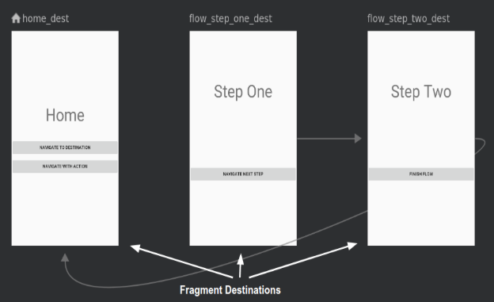
#### **Cómo explorar el editor de navegación**
1. Abrir res/navigation/mobile_navigation.xml

2. Haz clic en **Design** para ir al modo de diseño:

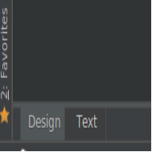

   Deberías ver lo siguiente:

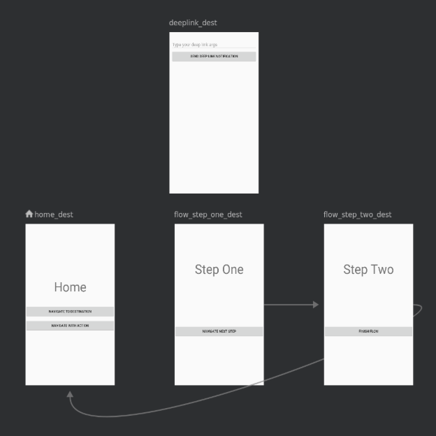

El gráfico de navegación muestra los destinos disponibles. Las flechas entre los destinos se denominan *acciones*. Más adelante, obtendrás más información sobre las acciones.

3. Haz clic en un destino para ver sus atributos.

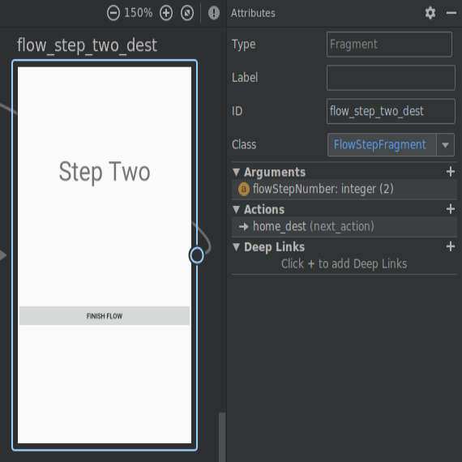

4. Haz clic en cualquier acción, representada con una flecha, para ver sus atributos.

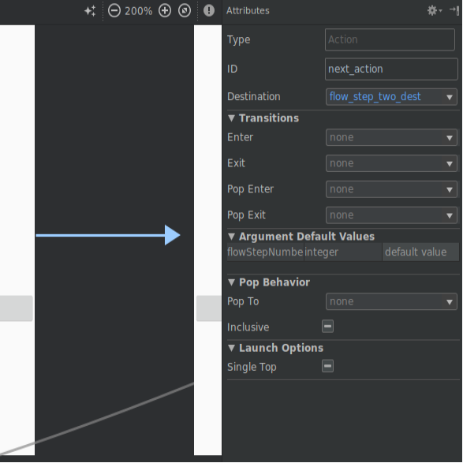
#### **Anatomía de un archivo de navegación en formato XML**
Todos los cambios que realices en el editor de navegación gráfica cambian el archivo XML subyacente, de forma parecida a la manera en la que el editor de diseño modifica el XML de diseño.

Haz clic en la pestaña **Text**:

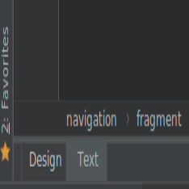

Verás algunos XML como este:
```xml
<navigation
  xmlns:android="http://schemas.android.com/apk/res/android"
  xmlns:app="http://schemas.android.com/apk/res-auto"
  xmlns:tools="http://schemas.android.com/tools"
  app:startDestination="@+id/home_dest">
  <!-- ...tags for fragments and activities here -->
  </navigation>
```

Ten en cuenta que:

- <navigation> es el nodo raíz de cada gráfico de navegación.
- <navigation> contiene uno o más destinos, representados con elementos <activity> o <fragment>. 
- app:startDestination es un atributo que especifica el destino que se inicia de forma predeterminada cuando el usuario abre la app por primera vez.

Veamos un destino de fragmento:

```xml
<fragment
  android:id="@+id/flow_step_one_dest"
  android:name="com.example.android.codelabs.navigation.FlowStepFragment"
  tools:layout="@layout/flow_step_one_fragment">
<argument.../>
<action
  android:id="@+id/next_action"
  app:destination="@+id/flow_step_two_dest">
</action>
</fragment>
```

Ten en cuenta que:

- android:id define un ID para el fragmento, que puedes usar en otra parte del archivo XML y de tu código para hacer referencia al destino.
- android:name declara el nombre de clase completamente calificado del fragmento para crear una instancia cuando navegas a ese destino.
- tools:layout especifica cuál es el diseño que se debe mostrar en el editor gráfico.

Algunas etiquetas <fragment> también contienen objetos <action>, <argument>, y <deepLink>, que analizaremos más adelante.

La app de ejemplo comienza con algunos destinos en el gráfico. En este paso, agregarás un destino nuevo. Antes de poder navegar al gráfico de navegación, debes agregar un destino que te lleve a él. 

**Nota:** En el código que descargaste, se incluyen los códigos para cada paso de este codelab, comentado entre sentencias TODO. 

Debes comparar el código que escribes con el código comentado.

1. Abre res/navigation/mobile_navigation.xml y haz clic en la pestaña **Design**.

2. Haz clic en el ícono **New Destination** y selecciona "settings_fragment".

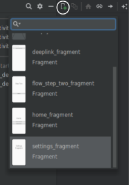

El resultado es un nuevo destino, que presenta una vista previa del diseño del fragmento en la vista de diseño.

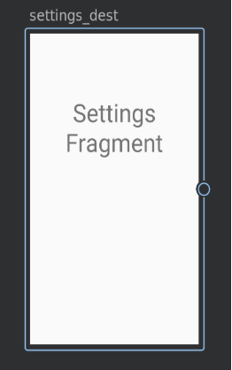

Ten en cuenta que también puedes editar directamente el archivo XML para agregar destinos:

**mobile_navigation.xml**

<fragment    android:id="@+id/settings_dest"    android:name="com.example.android.codelabs.navigation.SettingsFragment"    android:label="@string/settings"    tools:layout="@layout/settings_fragment" />

Para seguir nuestra convención de nombres, reemplaza el ID del valor predeterminado settingsFragment por settings_dest.

Ahora tienes este increíble gráfico de navegación, pero en realidad no lo estás utilizando para navegar.
#### **Actividades y navegación**
El componente Navigation sigue las pautas descritas en los [Principios de Navigation](http://d.android.com/topic/libraries/architecture/navigation/navigation-principles?hl=es-419 "http://d.android.com/topic/libraries/architecture/navigation/navigation-principles?hl=es-419"). Los Principios de Navigation te recomiendan que uses actividades como puntos de entrada para tu app. Las actividades también incluyen navegación global, como la barra de navegación inferior.

Por otro lado, los fragmentos serán, en realidad, los diseños específicos del destino.

A fin de que todo esto funcione, debes modificar los diseños de tu actividad para que contengan un widget especial llamado [**NavHostFragment**](http://d.android.com/reference/androidx/navigation/fragment/NavHostFragment?hl=es-419 "http://d.android.com/reference/androidx/navigation/fragment/NavHostFragment?hl=es-419"). Un NavHostFragment se encarga de intercambiar los diferentes destinos de fragmentos dentro y fuera a medida que navegas por el gráfico de navegación.

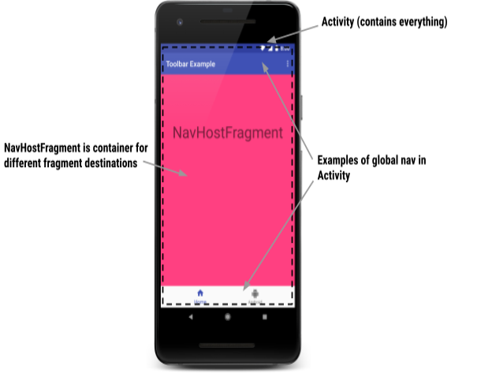

Un diseño simple que admite una navegación, parecido al de la imagen de arriba, se ve de esta manera. Puedes encontrar un ejemplo de este código en res/layout-470dp/navigation_activity.xml:

```xml
<LinearLayout.../>
<androidx.appcompat.widget.Toolbar.../>
<fragment
  android:layout_width="match_parent"
  android:layout_height="0dp"
  android:layout_weight="1"
  android:id="@+id/my_nav_host_fragment"
  android:name="androidx.navigation.fragment.NavHostFragment"        app:navGraph="@navigation/mobile_navigation"
  app:defaultNavHost="true"
/>
<com.google.android.material.bottomnavigation.BottomNavigationView.../>
</LinearLayout>
```

Ten en cuenta que:

- Este es el diseño de una actividad y contiene navegación global, incluidas una barra de navegación inferior y una barra de herramientas.
- android:name="androidx.navigation.fragment.NavHostFragment" y app:defaultNavHost="true" conectan el botón Atrás del sistema al NavHostFragment.
- app:navGraph="@navigation/mobile_navigation" asocia el NavHostFragment a un gráfico de navegación. Este gráfico de navegación especifica todos los destinos a los que el usuario puede navegar en este NavHostFragment.
#### **NavController**
Por último, cuando un usuario realiza una acción, como hacer clic en un botón, debe activarse un comando de navegación. Una clase especial llamada [**NavController**] es la que activa el intercambio de fragmentos en el NavHostFragment. 

```kotlin
// Command to navigate to flow_step_one_dest
findNavController().navigate(R.id.flow_step_one_dest)
```

Ten en cuenta que, para navegar, se pasa un ID de destino o de acción. Estos son los ID definidos en el XML del gráfico de navegación. Este es un ejemplo de cómo pasar un ID de destino.

NavController es potente porque cuando llamas a métodos como navigate() o popBackStack(),, convierte esos comandos en las operaciones de framework correspondientes según el tipo de destino al que navegas o del que navegas. Por ejemplo, cuando llamas a navigate() con un destino de actividad, NavController llama a startActivity() por ti.

Existen algunas formas de obtener un objeto NavController asociado a tu NavHostFragment. En Kotlin, se recomienda que uses una de las siguientes funciones de extensión, según llames al comando de navegación desde un fragmento, una actividad o una vista:

- [Fragment.findNavController()](https://developer.android.com/reference/kotlin/androidx/navigation/fragment/package-summary?hl=es-419#findnavcontroller "https://developer.android.com/reference/kotlin/androidx/navigation/fragment/package-summary?hl=es-419#findnavcontroller")
- [View.findNavController()](https://developer.android.com/reference/kotlin/androidx/navigation/package-summary?hl=es-419#(android.view.View).findNavController() "https://developer.android.com/reference/kotlin/androidx/navigation/package-summary?hl=es-419#(android.view.View).findNavController()")
- [Activity.findNavController(viewId: Int)](https://developer.android.com/reference/kotlin/androidx/navigation/package-summary?hl=es-419#findnavcontroller "https://developer.android.com/reference/kotlin/androidx/navigation/package-summary?hl=es-419#findnavcontroller")

Tu NavController está asociado a un NavHostFragment. Por lo tanto, cualquiera sea el método que utilices, debes asegurarte de que el fragmento, la vista o el ID de la vista sean un NavHostFragment en sí mismos o tengan un NavHostFragment como elemento principal. De lo contrario, obtendrás una IllegalStateException.
#### **Cómo navegar a un destino con NavController**
Es tu turno de navegar con [NavController][**NavController**]. Conecta el botón **Navigate to Destination** para navegar al destino flow_step_one_dest (que es un FlowStepFragment):

1. Abre HomeFragment.kt.

2. Conecta navigate_destination_button con onViewCreated().

**HomeFragment.kt**
```kotlin
val button = view.findViewById<Button>(R.id.navigate_destination_button)
button?.setOnClickListener {
      findNavController().navigate(R.id.flow_step_one_dest, null)}
```

3. Ejecuta la app y haz clic en el botón **Navigate to Destination**. Ten en cuenta que el botón navega al destino flow_step_one_dest.

También puedes usar el método de conveniencia [Navigation.createNavigateOnClickListener(@IdRes destId: int, bundle: Bundle)](https://developer.android.com/reference/kotlin/androidx/navigation/Navigation?hl=es-419#createNavigateOnClickListener(kotlin.Int,+android.os.Bundle) "https://developer.android.com/reference/kotlin/androidx/navigation/Navigation?hl=es-419#createNavigateOnClickListener(kotlin.Int,+android.os.Bundle)"), que creará un OnClickListener para navegar a un destino determinado con un conjunto de argumentos que se pasarán al destino.

El código del objeto de escucha de clics se vería de la siguiente manera:

```kotlin
val button = view.findViewById<Button>(R.id.navigate_destination_button)
button?.setOnClickListener(        Navigation.createNavigateOnClickListener(R.id.flow_step_one_dest, null))
```
#### **Cómo cambiar la transición de navegación**
Cada llamada a navigate() tiene una transición predeterminada no muy emocionante asociada, como se muestra a continuación:

![ref1]

La transición predeterminada y otros atributos asociados a la llamada pueden anularse con la inclusión de un conjunto de NavOptions. NavOptions usa un patrón Builder que permite anular y configurar solo las opciones que necesitas. También hay una DSL ktx para NavOptions, que es lo que usarás.

Para las transiciones animadas, puedes definir recursos de animación XML en la carpeta de recursos anim y, luego, usar esas animaciones en las transiciones. Se incluyen algunos ejemplos en el código de la app.

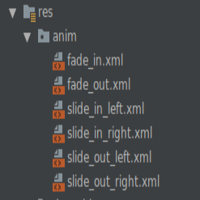
#### **Cómo agregar una transición personalizada**
Actualiza el código para que muestre una animación de transición personalizada cuando se presione el botón **Navigate to Destination**.

1. Abre HomeFragment.kt.

2. Define un elemento NavOptions y pásalo a la llamada de navigate() a navigate_destination_button.
```kotlin
val options = navOptions {
      anim {
          enter = R.anim.slide_in_right
          exit = R.anim.slide_out_left
          popEnter = R.anim.slide_in_left
          popExit = R.anim.slide_out_right    
      }
}
view.findViewById<Button>(R.id.navigate_destination_button)?.setOnClickListener {
      findNavController().navigate(R.id.flow_step_one_dest, null, options)}
```

3. Si todavía no lo hiciste, quita el código que se agregó en el paso 5.

4. Verifica que el fragmento se deslice hacia la pantalla cuando presionas el botón **Navigate To Destination** y que salga de ella cuando presionas Atrás.

![ref2]
#### Acciones
El sistema de navegación también te permite navegar a través de las *acciones*. Como se mencionó anteriormente, las líneas que se muestran en el gráfico de navegación son representaciones visuales de las acciones.

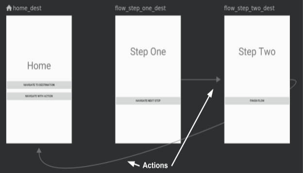

La navegación por acciones tiene los siguientes beneficios sobre la navegación por destino:

- Puedes visualizar las rutas de navegación de tu app.
- Las acciones pueden contener atributos asociados adicionales que puedes configurar, como una animación de transición, valores de argumentos y comportamiento de la pila de actividades.
- Para navegar, puedes usar Safe Args del complemento, que verás en breve.

Estas son las imágenes y el XML para la acción que conecta flow_step_one_dest con flow_step_two_dest:

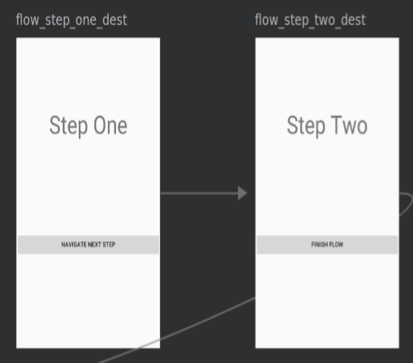

```xml
<fragment    
  android:id="@+id/flow_step_one_dest"
  android:name="com.example.android.codelabs.navigation.FlowStepFragment">    
  <argument.../>    
  <action
  android:id="@+id/next_action"
  app:destination="@+id/flow_step_two_dest">
  </action>
</fragment>
<fragment    
  android:id="@+id/flow_step_two_dest"
  android:name="com.example.android.codelabs.navigation.FlowStepFragment">    <!-- ...removed for simplicity-->
</fragment>
```

Ten en cuenta que:

- Las acciones se anidan dentro del destino, que es desde el que navegarás.
- La acción incluye un argumento de destino que hace referencia a flow_step_two_dest, que es el ID de la página a la que navegarás.
- El ID de la acción es "next_action". 

A continuación, se muestra otro ejemplo de la acción que conecta flow_step_two_dest con home_dest:

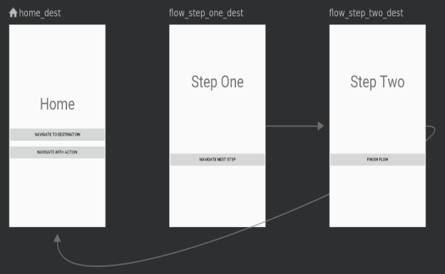
```xml
<fragment
  android:id="@+id/home_dest"
  android:name="com.example.android.codelabs.navigation.HomeFragment"
.../>
<fragment
  android:id="@+id/flow_step_two_dest"
  android:name="com.example.android.codelabs.navigation.FlowStepFragment"
>
<argument.../>
<action
  android:id="@+id/next_action"
  app:popUpTo="@id/home_dest"
  >
</action></fragment>
```

Ten en cuenta que:

- Se usa el mismo ID next_action para la acción que conecta flow_step_two_dest con home_dest. Con este ID, puedes navegar tanto desde flow_step_one_dest, como desde flow_step_two_dest. Este es un ejemplo de cómo las acciones pueden proporcionar un nivel de abstracción y te permiten navegar a un lugar diferente según el contexto.
- Se usa el atributo popUpTo; esta acción quitará fragmentos de la pila de actividades hasta llegar a home_dest.
#### **Cómo navegar con una acción**
Es hora de conectar el botón **Navigate with Action** para que navegue con una acción.

1. Abre el archivo mobile_navigation.xml en el modo **Design**.

2. Arrastra una flecha de home_dest a flow_step_one_dest:

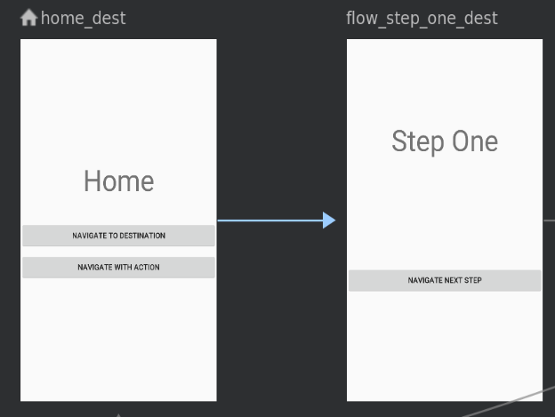

3. Con la flecha de acción seleccionada (azul), cambia las propiedades de la acción para que:

- El ID sea next_action.
- La transición de entrada sea slide_in_right.
- La transición de salida sea slide_out_left.
- La transición de entrada de la ventana emergente sea slide_in_left.
- La transición de salida de la ventana emergente sea slide_out_right.

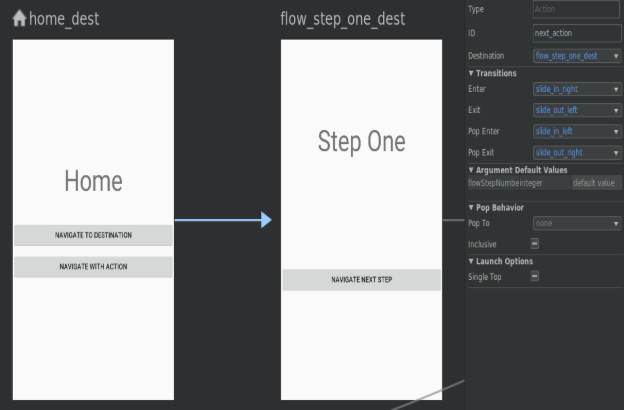

4. Haz clic en la pestaña **Text**.

Verás que se agregó una acción next_action nueva al destino home_dest.
#### **mobile_navigation.xml**	
```xml
<fragment android:id="@+id/home_dest"...>
<action
  android:id="@+id/next_action"
  app:destination="@+id/flow_step_one"
  app:enterAnim="@anim/slide_in_right"
  app:exitAnim="@anim/slide_out_left"
  app:popEnterAnim="@anim/slide_in_left"
  app:popExitAnim="@anim/slide_out_right" />
```

5. Abre HomeFragment.kt.

6. Agrega un objeto de escucha de clics al navigate_action_button.
#### **HomeFragment.kt**
```kotlin
view.findViewById<Button>(R.id.navigate_action_button)?.setOnClickListener(
  Navigation.createNavigateOnClickListener(R.id.next_action, null))
```

Las acciones te permiten adjuntar NavOptions en el archivo XML de navegación, en lugar de especificarlas de manera programática.

7. Verifica que, cuando presiones **Navigate to Action**, ahora se navegue a la siguiente pantalla.
#### Safe Args
El componente Navigation tiene un complemento de Gradle llamado [**Safe Args**](https://developer.android.com/topic/libraries/architecture/navigation/navigation-pass-data?hl=es-419#Safe-args "https://developer.android.com/topic/libraries/architecture/navigation/navigation-pass-data?hl=es-419#Safe-args"), que genera clases simples de objeto y compilador para el acceso con seguridad de tipos a argumentos específicos de destinos y acciones.

Safe Args te permite deshacerte de código como este cuando pasas valores entre destinos:

val username = arguments?.getString("usernameKey")

En lugar de eso, puedes reemplazarlo por código que haya generado métodos set y get.

val username = args.username

Gracias a la seguridad de tipo, la navegación con clases generadas por Safe Args es la forma preferida de navegar por acción y de pasar argumentos durante la navegación.
##### **Cómo pasar un valor con Safe Args**
1. Abre el archivo build.gradle del proyecto y observa el complemento Safe Args:
##### **build.gradle**
```xml
dependencies {
          classpath "androidx.navigation:navigation-safe-args-gradle-plugin:$navigationVersion"    //...    }
```

2. Abre el archivo app/build.gradle y observa el complemento aplicado:
##### **app/build.gradle**
```gradle
apply plugin: 'com.android.application'
apply plugin: 'kotlin-android'
apply plugin: 'androidx.navigation.safeargs.kotlin'

android {   //...
}
```

3. Abre mobile_navigation.xml, y observa cómo se definen los argumentos del destino flow_step_one_dest. 

#### **mobile_navigation.xml**
```xml
<fragment
  android:id="@+id/flow_step_one_dest"
  android:name="com.example.android.codelabs.navigation.FlowStepFragment"
  tools:layout="@layout/flow_step_one_fragment"
  >
<argument
  android:name="flowStepNumber"
  app:argType="integer"
  android:defaultValue="1"/>
<action...></action>
</fragment>
```

Con la etiqueta <argument>, Safe Args genera una clase llamada FlowStepFragmentArgs. 

![ref3]

Dado que el archivo XML incluye un argumento llamado flowStepNumber, especificado por android:name="flowStepNumber", la clase FlowStepFragmentArgs generada incluirá una variable flowStepNumber con métodos get y set.

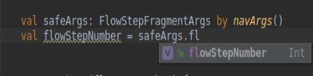

4. Abre FlowStepFragment.kt.

5. Comenta la línea de código que se muestra a continuación:
### **FlowStepFragment.kt**
```kotlin
// Comment out this line
// val flowStepNumber = arguments?.getInt("flowStepNumber")
```

Este código anticuado no cuenta con seguridad de tipos, por lo que es mejor usar Safe Args.

6. Actualiza FlowStepFragment para usar la clase FlowStepFragmentArgs generada con el código. Se obtendrán los argumentos FlowStepFragment con seguridad de tipos.
### **FlowStepFragment.kt**

```kotlin
val safeArgs: FlowStepFragmentArgs by navArgs()
val flowStepNumber = safeArgs.flowStepNumber
```

### **Clases Directions de Safe Args**
También puedes usar Safe Args para navegar con seguridad de tipo, ya sea que agregues argumentos o no. Esto se hace con las clases Directions generadas. 

![ref4]

Las clases Directions se generan para todos los diferentes destinos con acciones. La clase Directions incluye métodos para cada acción que un destino tenga.

Por ejemplo, el objeto de escucha de clics navigate_action_button en HomeFragment.kt podría cambiarse a:
### **HomeFragment.kt**
```kotlin
// Note the usage of curly braces since we are defining the click listener lambda
view.findViewById<Button>(R.id.navigate_action_button)?.setOnClickListener {
      val flowStepNumberArg = 1
      val action = HomeFragmentDirections.nextAction(flowStepNumberArg)
      findNavController().navigate(action)}
```

Ten en cuenta que puedes proporcionar un defaultValue para cada argumento en el archivo XML de tu gráfico de navegación. Si *no* lo haces, **debes** pasar el argumento a la acción, como se muestra:

HomeFragmentDirections.nextAction(flowStepNumberArg)

# **JobService**
JobService es una clase en Android que te permite programar y ejecutar tareas en segundo plano de manera eficiente. Puedes usarlo para realizar tareas que no requieren la interacción del usuario, como descargar o subir datos, realizar operaciones de mantenimiento o procesamiento de datos, o sincronizar información entre diferentes servicios o aplicaciones.

Para usar JobService, necesitas seguir los siguientes pasos:

1. Crear una clase que extienda JobService: Debes crear una nueva clase que extienda JobService y sobrescribir el método onStartJob(), que es donde se define el trabajo a realizar en segundo plano.
1. Crear una instancia de JobInfo: La clase JobInfo te permite configurar el trabajo que se realizará en segundo plano, por ejemplo, la frecuencia de ejecución, las condiciones de red, la batería, etc.
1. Iniciar el trabajo: Una vez que hayas creado la instancia de JobInfo, debes pasarla a la clase JobScheduler, que es la encargada de iniciar y administrar los trabajos en segundo plano.

Aquí te presento un ejemplo simple que te muestra cómo usar JobService:

```kotlin
public class MiJobService extends JobService {
      @Override
      public boolean onStartJob(JobParameters params) {
          // Aquí es donde se realiza el trabajo en segundo plano
          // ...
          // Cuando se complete el trabajo, debes llamar a jobFinished()
          jobFinished(params, false);
          return false;
      }

      @Override
      public boolean onStopJob(JobParameters params) {
          return true;
      }

}
```

En el código anterior, se define la clase MiJobService que extiende JobService y sobrescribe el método onStartJob(). En este método, se realiza el trabajo en segundo plano y se llama al método jobFinished() cuando el trabajo ha sido completado. También se sobrescribe el método onStopJob() que se llama cuando el trabajo es cancelado.

Para iniciar el trabajo, se debe crear una instancia de JobInfo, por ejemplo:

```kotlin
JobInfo jobInfo = new JobInfo.Builder(1, new ComponentName(this, MiJobService.class))
.setRequiredNetworkType(JobInfo.NETWORK_TYPE_UNMETERED)
.setPeriodic(15 * 60 * 1000) // cada 15 minutos
.build();
```

En el ejemplo anterior, se define una instancia de JobInfo que se ejecutará cada 15 minutos y requiere una conexión de red no medible.

Finalmente, para iniciar el trabajo, debes llamar al método schedule() de la clase JobScheduler, pasándole la instancia de JobInfo:

JobScheduler jobScheduler = (JobScheduler) getSystemService(Context.JOB_SCHEDULER_SERVICE);

jobScheduler.schedule(jobInfo);

Con estos pasos, habrás configurado y ejecutado un trabajo en segundo plano usando JobService en Android.

# **Inyección de dependencias con hilt**
Hilt es una biblioteca de inserción de dependencias para Android que permite reducir el trabajo repetitivo de insertar dependencias de forma manual en tu proyecto. Para la [**inserción manual de dependencias**](https://developer.android.com/training/dependency-injection/manual?hl=es-419 "https://developer.android.com/training/dependency-injection/manual?hl=es-419"), debes construir cada clase y sus dependencias de forma manual, y usar contenedores para reutilizar y administrar las dependencias.
## **Agregar dependencias**
### **build.gradle**
```gradle
plugins {
...
    id 'com.google.dagger.hilt.android' version '2.57.1' apply false
}
```

### **app/build.gradle**
```gradle
...
plugins {
    id 'com.google.devtools.ksp'
    id 'com.google.dagger.hilt.android'
}
android {
...
}

dependencies {
    implementation "com.google.dagger:hilt-android:2.57.1"
    ksp "com.google.dagger:hilt-compiler:2.57.1"
}
```

**Nota:** Los proyectos que usan Hilt y la [vinculación de datos](https://developer.android.com/topic/libraries/data-binding?hl=es-419 "https://developer.android.com/topic/libraries/data-binding?hl=es-419") requieren Android Studio 4.0 o una versión posterior.
### **app/build.gradle**
```gradle
android {
...
    compileOptions {
      sourceCompatibility JavaVersion.VERSION_1_8
      targetCompatibility JavaVersion.VERSION_1_8
    }
}
```

## **Uso de dagger hilt**
### **Activación de Hilt**
Todas las apps que usan Hilt deben contener una clase [Application](https://developer.android.com/reference/android/app/Application?hl=es-419 "https://developer.android.com/reference/android/app/Application?hl=es-419") anotada con @HiltAndroidApp.

@HiltAndroidApp activa la generación de código de Hilt, incluida una clase base para tu aplicación que sirve como contenedor de dependencia a nivel de la aplicación.

```kotlin
@HiltAndroidApp
class ExampleApplication : Application() { ... }
```

Se adjunta este componente generado por Hilt al ciclo de vida del objeto Application y le proporciona dependencias. Además, es el componente superior de la app, lo que significa que otros componentes pueden acceder a las dependencias que proporciona.
### **Cómo inyectar dependencias en clases de Android**
Una vez que se configura Hilt en tu clase Application y hay un componente disponible en el nivel de la aplicación, Hilt puede proporcionar dependencias para otras clases de Android que tengan la anotación @AndroidEntryPoint:

```kotlin
@AndroidEntryPoint
class ExampleActivity : AppCompatActivity() { ... }
```

En la actualidad, la versión de Hilt admite las siguientes clases de Android:

- Application (mediante @HiltAndroidApp)
- ViewModel (mediante @HiltViewModel)
- Activity
- Fragment
- View
- Service
- BroadcastReceiver

Si anotas una clase de Android con @AndroidEntryPoint, también debes anotar las clases de Android que dependen de ella. Por ejemplo, si anotas un fragmento, también debes anotar todas las actividades en las que uses ese fragmento.

**Nota:** Las siguientes expectativas se aplican a la compatibilidad de Hilt con las clases de Android:

- Hilt solo admite actividades que extienden [**ComponentActivity**](https://developer.android.com/reference/kotlin/androidx/activity/ComponentActivity?hl=es-419 "https://developer.android.com/reference/kotlin/androidx/activity/ComponentActivity?hl=es-419"), como [**AppCompatActivity**](https://developer.android.com/reference/kotlin/androidx/appcompat/app/AppCompatActivity?hl=es-419 "https://developer.android.com/reference/kotlin/androidx/appcompat/app/AppCompatActivity?hl=es-419").
- Hilt solo admite fragmentos que extienden **androidx.Fragment**.
- Hilt no admite fragmentos retenidos.

**@AndroidEntryPoint** genera un componente individual de Hilt para cada clase de Android de tu proyecto. Estos componentes pueden recibir dependencias de sus respectivas clases superiores, como se describe en Jerarquía de los componentes.

Para obtener dependencias de un componente, usa la anotación **@Inject** a fin de realizar la inyección de campo:

```kotlin
@AndroidEntryPoint
class ExampleActivity : AppCompatActivity() {
    @Inject lateinit var analytics: AnalyticsAdapter
...
}
```

**Nota:** Los campos que Hilt inyecta no pueden ser privados. Si intentas inyectar un campo privado con Hilt, se generará un error de compilación.
#### **Inyección por constructor**
Una forma de proporcionar información de vinculación a Hilt es la *inyección de constructor*. Usa la anotación **@Inject** en el constructor de una clase para indicarle a Hilt cómo proporcionar instancias de esa clase:

```kotlin
class AnalyticsAdapter @Inject constructor(
    private val service: AnalyticsService
) { ... }
```

#### **Módulos de Hilt**
A veces, el tipo no se puede insertar con un constructor, lo que puede suceder por varios motivos. Por ejemplo, no puedes insertar una interfaz con un constructor. Tampoco puedes inyectar con un constructor un tipo que no sea de tu propiedad, como una clase de una biblioteca externa. En estos casos, puedes proporcionar información de vinculación mediante módulos de Hilt.

Un módulo de Hilt es una clase anotada con @Module. Al igual que los módulos de Dagger, informa a Hilt cómo proporcionar instancias de determinados tipos. A diferencia de los módulos de Dagger, debes anotar los módulos de Hilt con @InstallIn para indicarle a Hilt en qué clase de Android se usará o instalará cada módulo.

**Nota:** Debido a que para generar código de Hilt se necesita acceso a todos los módulos de Gradle que usan Hilt, el módulo de Gradle que compila tu clase **Application** también debe tener todos los módulos y las clases inyectadas con constructor en sus dependencias transitivas.
# **Android Studio**
## Variantes de compilación.
Cada variante de compilación representa una versión diferente  de tu app que puedes compilar. Por ejemplo, es posible que desees  compilar una versión de tu app que sea gratuita con contenido limitado y  una versión pagada que incluya más contenido. También puedes compilar  diferentes versiones de tu app para diferentes dispositivos, según el  nivel de API y otras variantes de dispositivos. 

Las variantes de compilación surgen del uso de un conjunto específico  de reglas a través de Gradle para combinar los parámetros de  configuración, código y recursos configurados en tus tipos de  compilación y variantes de productos. Aunque no configuras variantes de  compilación directamente, sí configuras los tipos de compilación y las  variantes de productos que las forman.
### **Cómo configurar tipos de compilaciones**
Puedes crear y configurar tipos de compilaciones dentro del bloque android del archivo build.gradle.kts a nivel del módulo. Cuando creas un módulo nuevo, Android Studio genera automáticamente los tipos de compilación de depuración y lanzamiento. Si bien el tipo de compilación de depuración no aparece en el archivo de configuración de compilación, Android Studio lo configura con debuggable true. Esta configuración te permite depurar la app en dispositivos Android seguros y configura la firma de la app con un almacén de claves de depuración genérico.

Puedes agregar el tipo de compilación de depuración a tu configuración si deseas agregar o cambiar determinadas opciones de configuración. En el siguiente ejemplo, se especifica un applicationIdSuffix para el tipo de compilación de depuración y se configura un tipo de compilación "staging" (etapa de pruebas) que se inicializa con la configuración del tipo de compilación de depuración: 

```gradle
android {
      defaultConfig {
          manifestPlaceholders = [hostName:"www.example.com"]
...
      }
      buildTypes {
          release {
              minifyEnabled true
              proguardFiles getDefaultProguardFile('proguard-android.txt'), 'proguard-rules.pro'
          }

          debug {
              applicationIdSuffix ".debug"
              debuggable true
          }
          /**

           * The `initWith` property lets you copy configurations from other build types,

           * then configure only the settings you want to change. This one copies the debug build

           * type, and then changes the manifest placeholder and application ID.

           */

          staging {

              initWith debug

              manifestPlaceholders = [hostName:"internal.example.com"]

              applicationIdSuffix ".debugStaging"

          }

      }

}
```

### **Cómo configurar variantes de productos**
   Crear tipos de productos es similar a crear tipos de compilación. Agrega variantes de productos al bloque productFlavors de tu configuración de compilación e incluye los parámetros de configuración que desees. Las variantes de productos admiten las mismas propiedades que defaultConfig, ya que defaultConfig en realidad pertenece a la clase [ProductFlavor](https://developer.android.com/reference/tools/gradle-api/current/com/android/build/api/dsl/ProductFlavor?hl=es-419 "https://developer.android.com/reference/tools/gradle-api/current/com/android/build/api/dsl/ProductFlavor?hl=es-419"). Eso significa que puedes proporcionar la configuración básica para todas las variantes en el bloque defaultConfig, y cada una puede cambiar cualquiera de estos valores predeterminados; por ejemplo, applicationId. Para obtener más información sobre el ID de aplicación, consulta [Cómo establecer el ID de aplicación](https://developer.android.com/studio/build/configure-app-module?hl=es-419#set-application-id "https://developer.android.com/studio/build/configure-app-module?hl=es-419#set-application-id"). 

**Nota:** No obstante, debes especificar un nombre de paquete usando el atributo [package](https://developer.android.com/guide/topics/manifest/manifest-element?hl=es-419#package "https://developer.android.com/guide/topics/manifest/manifest-element?hl=es-419#package") en el archivo de manifiesto main/. También debes usar ese nombre de paquete en tu código fuente para hacer referencia a la clase R, o bien resolver cualquier actividad o registro de servicio relacionados. Esto te permite usar applicationId para asignar a cada variante de producto un ID exclusivo para el empaquetado y la distribución, sin necesidad de cambiar el código fuente. 

   Todas las variantes deben pertenecer a una dimensión denominada, que es un grupo de variantes de productos. Debes asignar todas las variantes a una dimensión; de lo contrario, obtendrás el siguiente error de compilación.
## **Cómo configurar el módulo de la app**
### **Cómo establecer el ID de aplicación**
Cada app para Android tiene un ID de aplicación exclusivo similar a un nombre de paquete de Java o Kotlin (por ejemplo, *com.example.miapp*). Este ID permite identificar de manera exclusiva tu app en el dispositivo y en Google Play Store.

**Importante:** Una vez que publiques tu app, no debes cambiar el ID de aplicación. Si cambias el ID de aplicación, Google Play Store trata la carga como una app completamente diferente. Si quieres subir una versión nueva de tu app, debes usar el mismo ID de aplicación y [certificado de firma](https://developer.android.com/studio/publish/app-signing?hl=es-419 "https://developer.android.com/studio/publish/app-signing?hl=es-419") de cuando se publicó originalmente.

```gradle
android {    
  defaultConfig {
    applicationId "*com.example.myapp*"
    minSdkVersion 15
    targetSdkVersion 24
    versionCode 1
    versionName "1.0"
  }
}
```

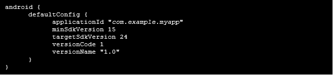El ID de aplicación se define con la propiedad applicationId en la biblioteca build.gradle.kts, como se muestra aquí. Actualiza el valor de applicationId reemplazando com.example.myapp con tu ID de la aplicación:

# **Preguntas para entrevista.**
¿Qué lenguajes de programación manejas?

¿Qué patrones de diseño conoces?

¿Opciones para almacenamiento de datos de la app?

- **Almacenamiento específico de la app**
- **Almacenamiento compartido**
- **Preferencias**
- **Bases de datos**

¿Qué librerías manejas?

¿Cómo haces una consulta Restful?

¿Diferencias entre constraint layout y linear layout?

¿Qué es un navigation component y sus componentes?

¿Qué es una corrutina?

¿Conoces viewBinding y dataBinding?

¿Qué componentes gráficos se usa para hacer una ventana flotante?

¿Conoces LiveData y para qué sirve?

¿Manejas Git?

¿Diferencia entre un fragmento y una activity?

¿Manejas Firebase, que servicios de Firebase has usado?

¿Conoces la inyección de dependencias, con que la haces?

[API de Flow]: https://developer.android.com/kotlin/flow?hl=es-419 "https://developer.android.com/kotlin/flow?hl=es-419"

[NavController]: https://developer.android.com/reference/androidx/navigation/NavController?hl=es-419 "https://developer.android.com/reference/androidx/navigation/NavController?hl=es-419"

[**NavController**]: http://d.android.com/reference/androidx/navigation/NavController?hl=es-419 "http://d.android.com/reference/androidx/navigation/NavController?hl=es-419"

[ref1]: Aspose.Words.4e276513-788f-4af8-9e8b-9cd31daeee0c.018.png
[ref2]: Aspose.Words.4e276513-788f-4af8-9e8b-9cd31daeee0c.020.png
[ref3]: Aspose.Words.4e276513-788f-4af8-9e8b-9cd31daeee0c.026.png
[ref4]: Aspose.Words.4e276513-788f-4af8-9e8b-9cd31daeee0c.028.png
