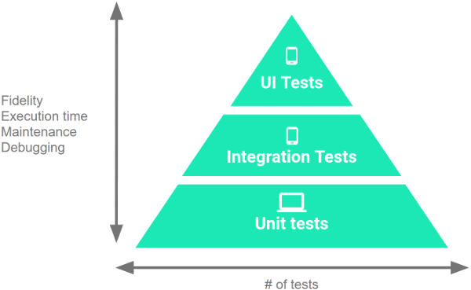

# ¿Que son los test?
Los test nos ayudar para validar el correcto funcionamiento del código que se encarga de hacer funcionar una aplicación móvil. Esto nos ayuda a controlar la parte compleja de la app y detectar que el nuevo código no haya dañado el código anterior.

## Beneficios:
Alertas sobre problemas o fallos.
Detectaremos rápidamente problemas mientras trabajamos en futuros desarrollos.
Simplifica los refactor (mejoras de código) ya que podremos optimizar funciones y asegurarnos de que seguirán funcionando.
Velocidad en el desarrollo y minimizar la deuda técnica.

## Tipos de test en Android
Piensa en los siguientes tipos como una piramide, donde las prueba de UI suelen tener una menor cantidad de test hechos y Unit Test son el tipo de test que más se le suele hacer a las aplicaciones móviles.



**UI Tests:**
Nos sirve para comprobar el funcionamiento de las vistas.

**Integration Tests:**
Una vez que ya funcionando todos los test Unitarios se procede a comprobar el flujo completo de todo lo que tenemos funciona.

**Unit Test:**
Permiten comprobar el funcionamiento aislado de cada una de las funcionalidades.

Por norma general esta es la proporcion de pruebas que se suele hacer a las aplicaciones móviles (pero no es una ciencia exacta y puede variar según el proyecto) 70% de Unit tests, un 20% de Integration tests y un 10% de UI Tests.

## Setup para comenzar las pruebas unitarias

Librerías a usar en android dentro del archivo build.gradle:
```Gradle
    testImplementation 'junit:junit:4.+'
    testImplementation "io.mockk:mockk:1.12.2"
```

**JUnit:** es una herramienta imprescindible para hacer test unitarios.

**Mockk:** esta ayudará a preparar mocks (son como imitadores de clases)

## ¿Que es un Mock?
Es un objeto falso que usamos para trucar o alterar resultados de funciones con el fin de testear lo que nos interesa.

## Testing y Directorios
En las librerías de android que se usan para hacer pruebas estan los tipos **TestImplementation** y **AndroidTestImplementation**. Esto se debe a que nuestro proyecto tiene dos carpetas de pruebas; **androidTest** y **test** (esto lo puedes ver en el explorador del proyecto android en android studio).

Las librerías que empiezan con **TestImplementation** solo servirán en la carpeta Test y las que empiezan con **AndroidTestImplementation** solo valdrán en AndroidTest.

La carpeta que menciona android almacenará los test que requieren del sistema operativo android y por consecuencia un emulador. La carpeta que no menciona Android no podrá contener el framework de Android, por tal mótivo la ejecución de sus test serán mucho más rápido.

## Ejemplo de Test Unitario en los casos de uso
El siguiente ejemplo se aplicó a una aplicación móvil, en específico a los casos de uso de la capa de dominio.

**Repositorio con los links de todos los tutoriales:** https://github.com/ArisGuimera/SimpleAndroidMVVM

**Lista de capítulos escritos de los tutoriales:** https://cursokotlin.com/tag/arquitectura-android-mvvm/

### Pasos de creación del test Unitario:

#### Creación de la clase test
Se crea una clase con el mismo nombre que tendrá la clase que se planea testear (en este caso se hizo la clase GetQuotesUseCase que testea a GetQuotesUseCaseTest). Para crear la prueba unitaria primero se abre la se clase (en este caso es un caso de uso), luego nos movemos al menú superior en la sección Navigate/Test; en caso de que no esté creado el test aparecerá un mensaje para crear el nuevo test, pero si ya existía en ese caso el IDE te reedireccionará a dicho test.

Se hará click en Create New Test y aparecerá la ventana flotante con toda la configuración de dicha clase. Esto hará que se creé el archivo test en un directorio similiar al del use case que se quiere testear, se mantendrá el JUnit4 y se recomienda dejar el archivo con el nombre con el que se genera.

En este caso se testeará el caso de uso y el resto se mockeará. En el ejemplo la clase GetQuotesUseCase recibe parámetros inyectados y la idea es mockear el repositorio para poder manipular las respuestas.

#### Before y After
Un tests es como una función, pero que tiene una notación en la parte superior. Con las etiquetas **@Before** y **@After** se pueden hacer configuraciones genéricas para la clase.

##### @Before
En este ejemplo con la Anotación @Before se inicializa la configuración inicial de la librería MockK antes de lanzar los test (la anotación @Before sirve para hacer las configuraciones iniciales antes de los test)

@Before

    fun onBefore() {
        MockKAnnotations.init(this)
    }

### Mockear el repositorio
#### @MockK
Sirve para definir un mock al cuál tendremos que configurarle cada respuesta que pudiera darnos la clase mockeada.

#### @RelaxedMockK
Sirve para definir mocks en los cuales no controlamos la respuesta de sus funciones y el sistema nos da una respuesta por defecto

**El siguiente es un ejemplo del mock que se hizo para el repositorio:**

```Java
@RelaxedMockK
private lateinit var quoteRepository: QuoteRepository
```

Con este código ya quedaría configurado el mock inicial, a continuación el ejemplo de como quedó la clase test:

```Java
class GetQuotesUseCaseTest {

    @RelaxedMockK
    private lateinit var quoteRepository: QuoteRepository

    lateinit var getQuotesUseCase: GetQuotesUseCase

    @Before
    fun onBefore() {
        MockKAnnotations.init(this)
        getQuotesUseCase = GetQuotesUseCase(quoteRepository)
    }
    
}
```

### Creando nuestro primer test.
Es hora de pensar que vamos a probar. En el ejemplo de este proyecto se llama al repositorio y dependiendo de la respuesta se hará una cosa u otra.

- Se comprobará si la respuesta del repositorio es vacía, entonces de llama a la base de datos.
- Se probará que se llame a las funciones y retorna el valor devuelto.

**Nota:** para los test es importante que el nombre sea muy descriptivo, es por eso que suelen tener nombres muy largos.

Estos son dos ejemplos de test que se escribieron para el proyecto que viene como ejemplo:

```Java
fun whenTheApiDoesntReturnAnythingThenGetValuesFromDatabase() = runBlocking{}
```

```Java
fun `when the api doesnt return anything then get values from database`() = runBlocking{}
```

En los ejemplos anteriores se utilizaron corrutinas, es por que eso que están usando **runBlocking{}** para lanzar la corrutina y ejecutar el test.

#### Given When Then

Given-When-Then es un patrón que se suele utilizar para escribir los test. Se explica de la siguiente forma:
- **Given:** Al mock se le da la respuesta que queremos que devuelva.
- **When:** Llama al caso de uso
- **Then:** Verifica que la función correcta del repositorio ha sido llamada.

A continuación viene el ejemplo del test 1 que se hizo en el proyecto:

```Java
    @Test
    fun `when the api doesnt return anything then get values from database`() = runBlocking {
        //Given
        coEvery { quoteRepository.getAllQuotesFromApi() } returns emptyList()

        //When
        getQuotesUseCase()

        //Then
        coVerify(exactly = 1) { quoteRepository.getAllQuotesFromDatabase() }
    }
```

**Given:** En el código anterior se llama a **'coEvery'** (cuando la función es una corrutina) o **'every'**, dentro se añade la función que debe ser llamada y se invoca el 'returns' y se le pone la respuesta que esperamos.

**When:** Luego se llama al caso de uso real para validar como resulta.

**Then:** Al final se utiliza 'coVerify' o 'verify' y se puede validar si la función dentro ha sido llamada. El parámetro 'exactly = 1' es para verificar que solo se haya invocado una vez el método, pero no es obligatoria.

Para ejecutar el test se debe pulsar el botón verde de play que está a la izquierda del nombre. Posterior a esto se abrirá la parte inferior del IDE con el resultado de la prueba.

### Creando el segundo test
A continuación viene el test 2 del proyecto ejemplo que usamos:

```Java
    @Test
    fun `when the api return something then get values from database`() = runBlocking {
        //Given
        val myList = listOf(Quote("Déjame un comentario", "AristiDevs"))
        coEvery { quoteRepository.getAllQuotesFromApi() } returns myList

        //When
        val response = getQuotesUseCase()

        //Then
        coVerify(exactly = 1) { quoteRepository.clearQuotes() }
        coVerify(exactly = 1) { quoteRepository.insertQuotes(any()) }
        coVerify(exactly = 0) { quoteRepository.getAllQuotesFromDatabase() }
        assert(response == myList)
    }
```

- **Given:** el repositorio debe retornar la lista de Quotes
- **When:** llama al caso de uso
- **Then:** Verifica métodos llamados y valida las respuestas del caso de uso es la misma que se dió al repositorio.

Este test es similar al anterior, pero el given específica la respuesta esperada por medio del objeto 'myList', el then verifica que se nombren algunos métodos si y otros no, la función assert verifica la respuesta del caso de uso es igual a la del repositorio.


### Testeando el segundo caso de uso.

Este caso de uso consulta a las bases de datos las citas y devuelve una de manera aleatoria. Si no hay citas guardadas devuelve null.

#### Configuración de la clase:
```Java
class GetRandomQuoteUseCaseTest {
    @RelaxedMockK
    private lateinit var quoteRepository: QuoteRepository

    lateinit var getRandomQuoteUseCase: GetRandomQuoteUseCase

    @Before
    fun onBefore() {
        MockKAnnotations.init(this)
        getRandomQuoteUseCase = GetRandomQuoteUseCase(quoteRepository)
    }

}
```

Al igual que con el caso anterior, se define el primer test que devolverá un listado vacío, osea un 'null'.

```Java
   @Test
    fun `when database is empty then return null`() = runBlocking {
        coEvery { quoteRepository.getAllQuotesFromDatabase() } returns emptyList()

        val response = getRandomQuoteUseCase()

        assert(response == null)
    }
```

Este test no tiene nada nuevo y se pasa al siguiente.
```Java
  @Test
    fun `when database is not empty then return quote`() = runBlocking {
        val quoteList = listOf(Quote("Holi", "AristiDevs"))

        coEvery { quoteRepository.getAllQuotesFromDatabase() } returns quoteList

        val response = getRandomQuoteUseCase()

        assert(response == quoteList.first())
    }
```

Al retornar un item del listado aleatorio es más complicado de probar, por tal motivo el listado solo contiene un objeto y si todo funciona debería devolver ese.

La clase completa está en el siguiente enlace: https://github.com/ArisGuimera/SimpleAndroidMVVM/tree/UnitTests

### Testing unitario avanzado
En el proyecto de ejemplo se testea el ViewModel y es un poco más complejo.

#### Añadiendo dependencias:
Se agregaron las siguiente dependencias en el archivo build.gradle.

```Gradle
implementation 'org.jetbrains.kotlinx:kotlinx-coroutines-android:1.6.0' //Ya estaba, la hemos actualizado.
testImplementation "org.jetbrains.kotlinx:kotlinx-coroutines-test:1.6.0"
testImplementation "androidx.arch.core:core-testing:2.1.0"
```

Se añadieron nuevas librerías para trabajar con LiveData y requería arch.core, además de que requiere coroutines-test para poder crear el dispatcher.

#### Testing en ViewModel
El proyecto de ejemplo solo tiene dos métodos en el viewmodel, getQuotesUseCase()(consultaba todos los quotes) y getRandomQuoteUseCase()(devolvía una cita y la insertaba en el LiveData para presentarlo en la vista). Se le crearon los siguientes test:
- El primero emulará el funcionamiento de cuando abrimos la app, que recupera el listado de quotes y muestra el primero, replicaremos eso.
- El segundo test comprobará nuestro «happy path» es decir, el flujo normal y óptimo de la app, que cuando se llame al randomQuote() se le asigne dicho valor a nuestro LiveData.
- Terminaremos comprobando lo contrario, si tenemos un valor ya en nuestro LiveData y la función randomQuote() devuelve null tendremos que mantener el último valor funcional.

#### Preparando ViewModelTest
Se crea la clase test:

```Java
class QuoteViewModelUnitTest {

    @RelaxedMockK
    private lateinit var getQuotesUseCase: GetQuotesUseCase

    @RelaxedMockK
    private lateinit var getRandomQuoteUseCase: GetRandomQuoteUseCase

    private lateinit var quoteViewModel: QuoteViewModel

    @Before
    fun onBefore() {
        MockKAnnotations.init(this)
        quoteViewModel = QuoteViewModel(getQuotesUseCase, getRandomQuoteUseCase)
    }

}
```

El test es parecido al anterior, solo que esta vez se mockearon los dos casos de uso que utiliza el ViewModel. El siguiente paso será crear una regla.

#### Reglas y dispatcher
Las librerías arch.core nos permiten testear los LiveData y será necesario crear una regla.

Las reglas permiten ser más flexible y evitar el código repetitivo. Además tiene el mismo comportamiento que el @Before, pero reutilizando el código. Por ejemplo crear una rebla que Inicializa los mocks: 

```Java
@get:Rule
var rule: InstantTaskExecutorRule = InstantTaskExecutorRule()
```

El proyecto de ejemplo usa viewModelScope para trabajar con corrutinas y por dicha razón es necesario modificar el dispatcher (dispatcher gestiona los hilos que usarán nuestras corrutinas) y para el testing se "truqueará". A continuación se define el propio dispatcher. 
    
```Java
    @Before
    fun onBefore() {
        MockKAnnotations.init(this)
        quoteViewModel = QuoteViewModel(getQuotesUseCase, getRandomQuoteUseCase)
        Dispatchers.setMain(Dispatchers.Unconfined)
    }

    @After
    fun onAfter() {
        Dispatchers.resetMain()
    }
```

La función onBefore se le añadió el dispatcher y la función onAfter nos servirá para reiniciarlo al terminar los tests.

#### Creando los tests.

Después de las configuraciones preeliminares se crea el primer test que devuelve un listado de citas y se asegura que el viewmodel asigne el primer elemento de la lista. En este caso para ViewModel se uso runTest en lugar de runBlocking, ya que se requiere para cada test del ViewModel.
    
```Java
    @Test
    fun `when viewmodel is created at the first time, get all quotes and set the first value`() = runTest{
        //Given
        val quote = listOf(Quote("Holi", "Aris"), Quote("Dame un like", "Otro Aris "))
        coEvery { getQuotesUseCase() } returns quote

        //When
        quoteViewModel.onCreate()

        //Then
        assert(quoteViewModel.quoteModel.value == quote.first())
    }
```

El siguiente test es sencillo y tiene un título muy descriptivo.

```Java
  @Test
    fun `if randomQuoteUseCase return null keep the last value`() = runTest{
        //Given
        val quote = Quote("Aris", "Aris")
        quoteViewModel.quoteModel.value = quote
        coEvery { getRandomQuoteUseCase() } returns null
        
        //When
        quoteViewModel.randomQuote()

        //Then
        assert(quoteViewModel.quoteModel.value == quote)
    }
```

Este último test es muy similar pero comienza con un valor por defecto a nuestro LiveData (quoteModel) comprueba si el caso de uso retorna null en vez de asignarlo mantiene el último valor.

